<!--
---
lang: fr
---
-->
<!-- .slide: data-background-image="images/home-alone.png" data-background-position="bottom left" data-background-size="contain" -->
# Maman, j'ai développé un synthétiseur dans mon navigateur!<!-- .element: style="margin-left: 20%;" -->


## Introduction
Notes:
- un deux un deux? titre.
- Bref, j'ai fait une clownerie
- aujourd'hui je vais vous parler d'un synthétiseur 
- le KORG MS-20, un modèle mythique, sortie en 1978 qui...
- en vrai je vais surtout vous parlez d'un side-project


### Side-project 
- apprendre 👨‍🎓
- s'amuser 🤡
Notes:
- un side project qui m'a pris beaucoup de temps
- voire même fait m'arracher les cheveux que je n'ai plus
- Un side project, ca devrait pas avoir d'autres d'objectifs sinon apprendre et s'amuser.


### Stack Technique 
- ⚛️ preact (🚥 + signals)
- 🔈 WebAudio
- 🐙 github actions
- ⚡ vite/vitest
Notes:
- faire "propre" quand même
- c'est une excuse pour apprendre
- on peut vouloir utiliser autre chose qu'angular
- sortir de mes compétences


### Qui-suis,je ?

- Benjamin Legrand
- Tech lead @ onepoint
- @benjilegnard


## Histoire(s)


### Mon oncle Jean-Pierre

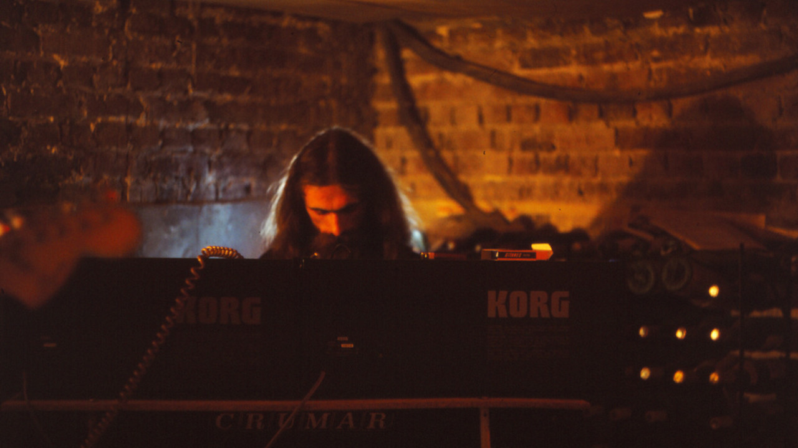

Notes:
- lui, c'est mon oncle Jean-pierre.
- enfin, c'était.
- là, il est dans la cave avec le groupe de mon père,
- et il joue du synthétiseur
- on est en mai 1980 ou quelque chose comme ça


### Les araignées malades

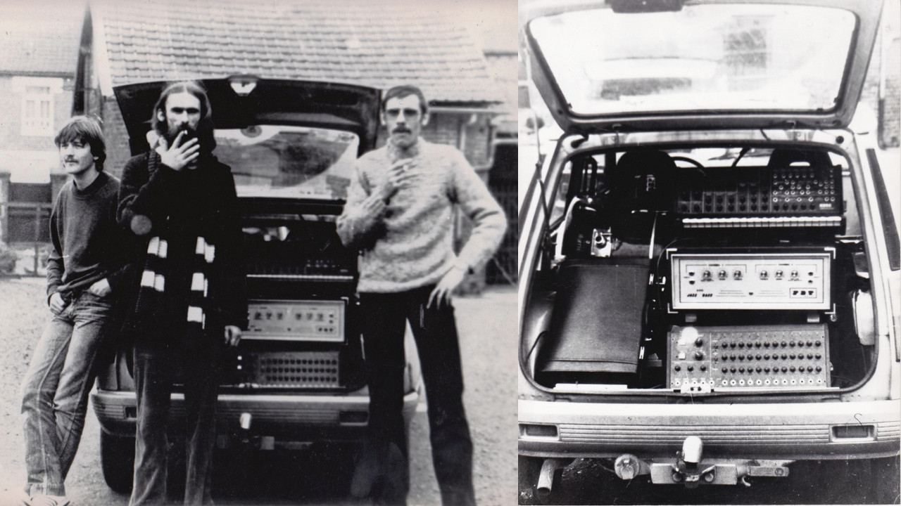

Notes:
- avec mon père, qui prends la photo ici.
- ils ont un groupe et ils jouent dans les caves et quelques balles musettes du nord-pas de calais ou de la somme.
- Stan Kogut-Kubiak à la basse
- Daniel Wasilewski à la batterie


### Le KORG MS-20

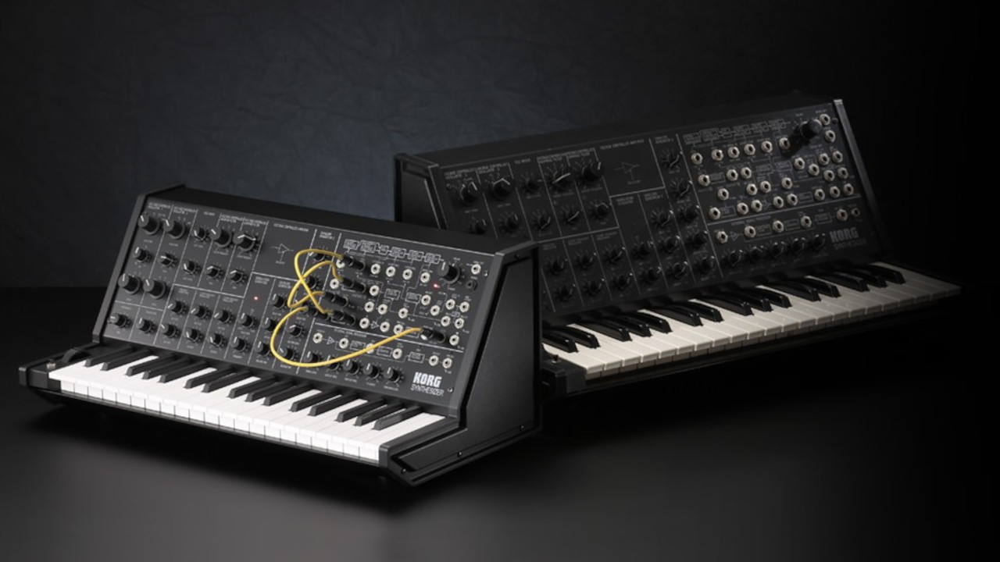
Notes:
- Le MS-20, sorti en 1978, c'est un synthétiseur, un clavier monophonique (une seule note à la fois)
- extrêmement populaire dans les années 80, grand public par rapport aux Moog et synthés existant
- simple à utiliser


### Vidéo?

// TODO
Notes:
- Je l'ai chez moi
- J'ai grandi avec, j'ai découvert la synthèse sonore et la musique électronique avec.


### Idée bizarre ou idée de  génie ?
- "ça colle"
Notes:
- Du coup je me lance dans ce projet bizarre.
- D'implémenter ce synthétiseur spécifiquement.
- Et donc la première question, c'est comment on fait de la musique avec un ordinateur.


## La musique


### Sans musique, la vie serait une erreur
<span class="fragment">Frédéric <span class="fragment strike">Nitch</span></span>
<span class="fragment"><span class="fragment strike">, Nietche</span></span>
<span class="fragment"><span class="fragment strike">, Nietsche</span></span>
<br/>
<span class="fragment">Friedrich Nietzsche</span>


### La musique c'est le silence entre les notes
Claude Debussy

Notes:
- En vrai, il l'avait piqué à mozart
- mais bref.


### Physiquement


Notes:
- Vibration dans l'air => Vos Tympans


### Source:


Notes:
- sourcez tout.


### La musique, c'est des maths

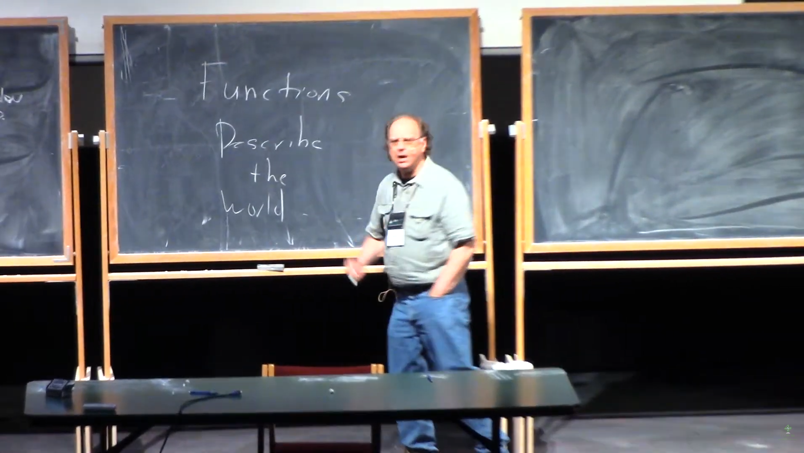

[On Mathematical Maturity - Thomas Garrity](https://www.youtube.com/watch?v=zHU1xH6Ogs4)<!--.element class="source" -->

Notes:
- Moi après trois bière
- Si vous connaissez pas cette vid elle est trop bien, Introduction à un cours de mathématiques
- Tout peut être décrit par une fonction mathématique


### En électricité analogique

- Un signal alternatif de + ou - 5 volts
Notes:
- le courant va dans un sens, puis dans l'autre
- le korg ms-20 utilise ça, 100% analogique, pas d'électronique
- quand vous branchez des enceintes à une chaine hi-fi, tout ça.
- pour un ordinateur, maintenant, c'est quoi ? 


### Le son, pour un ordinateur

C'est un tableau de chiffres. `Array<number>`.
```typescript
[0.52, 0.5, 0.3]
```

Notes:
- ok je simplifie à l'extrême -1 : 1
- on va plutôt utiliser des structures toutes faites pour ça. (Buffer)


### C'est un peu vague
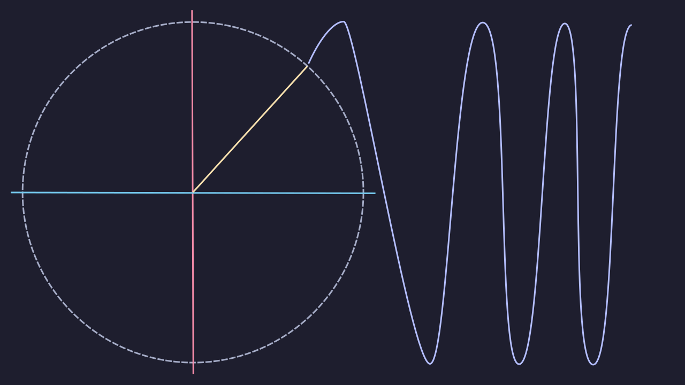
<!-- <div id="trigonometry" class="graphics"></div>-->
Notes:
- Pour faire une belle onde sonore, on fait une sinusoîdale
- dans ce talk on va parler de maths un peu donc les bases


### Une onde sinusoîdale à 440Hz ?

<div id="sound-test-sine" class="graphics"></div>
Notes:
- tout mes examples là dans mes slides, ils utilisent une API qui est disponible dans mes navigateurs
- 


### Faites du bruit

Si je remplis un tableau de valeur aléatoires

```typescript
context = new AudioContext();
const bufferSize = 2 * context.sampleRate;
const noiseBuffer = context.createBuffer(1, bufferSize, context.sampleRate);
const output = noiseBuffer.getChannelData(0);
for (let i = 0; i < bufferSize; i++) {
    output[i] = Math.random() * 2 - 1;
}
```
Notes:
- Math.random() emphasize.


### Faites du bruit (2)

<div id="sound-test-noise" class="graphics"></div>
Notes:
- parlons donc un peu de cette API.


## L'api WebAudio
Notes:
- pourquoi "ca colle, entre le synthé et ce projet)


### Historique
- Remember Flash ? 🪦
- Draft Spec W3C en 2011 📆
- High-level en JS, implementation en C/C++/Assembleur
Notes:
- avant cette api, il fallait des plugins externes
- Premier brouillons de specs en 2011
- Implémenté par google en premier
- codepen vers 2015 / 2016


### Example de base.

```typescript[|2-3|4|5|6|7]
if (window.AudioContext) {
    context = new AudioContext();
    oscillator = context.createOscillator();
    oscillator.type = "sine";
    oscillator.frequency.value = 440;
    oscillator.start();
    oscillator.connect(context.destination);
}
```

Notes:
- ça c'est le code de mon slide avec la sinusoide
- on crée un contexte, puis un oscillateur, on lui assigne une fréquence, et on la connecte à la sortie.


### AudioNode


Notes:
- ce qu'on manipule dans cette API c'est des noeuds.
- ça hérite d'EventTarget, parce qu'on peut lancer des événements.
- AudioNode la super classe
- plusieurs entrée / sortie
- connect() / disconnect() + channels
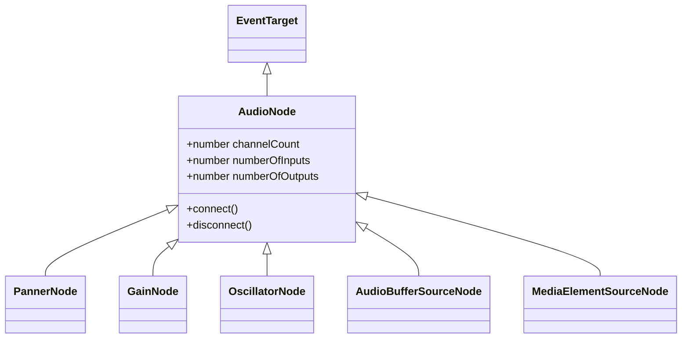
```mermaid
classDiagram
    EventTarget <|-- AudioNode
    AudioNode <|-- PannerNode
    AudioNode <|-- GainNode
    AudioNode <|-- OscillatorNode
    AudioNode <|-- AudioBufferSourceNode
    AudioNode <|-- MediaElementSourceNode
    class AudioNode{
      +number channelCount
      +number numberOfInputs
      +number numberOfOutputs
      +connect()
      +disconnect()
    }
```


### Des noeuds (au cerveau?)

```
AnalyzerNode
AudioBufferSourceNode
AudioWorkletNode
BiquadFilterNode
ChannelMergerNode
ChannelSplitterNode
ConstantSourceNode
ConvolverNode
DelayNode
DynamicsCompressorNode
GainNode
IIRFilterNode
MediaElementAudioSourceNode
MediaStreamAudioDestinationNode
MediaStreamAudioSourceNode
OscillatorNode
PannerNode
StereoPannerNode
WaveShaperNode
```
<https://developer.mozilla.org/en-US/docs/Web/API/AudioNode>
Notes:
- vous inquiètez pas on va pas tous les faire
- mon synth il est mono, donc déjà : un seul channel, tout ce qui est stéréo, on oublie


### graphe de routage audio

// TODO schema
Notes:
- tous ces noeuds dans mon code, on va les relier, et faire un graphe dirigé


### Rigolo ?

L'API est concue exactement comme on utiliserais un synthétiseur.

//TODO illustration synth modulaire
Notes:
- maintenant qu'on a vu ça, revenons en détail sur le MS-20


## Features du MS-20

<abbr title="Read The Fantastic Manual">R.T.F.M.</abbr>


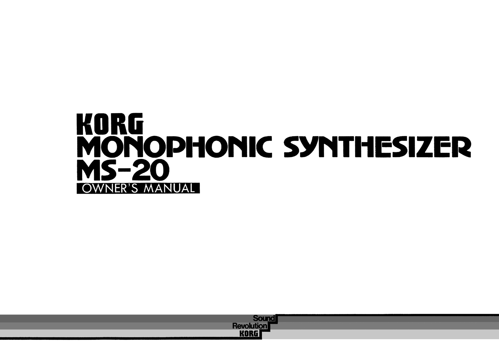


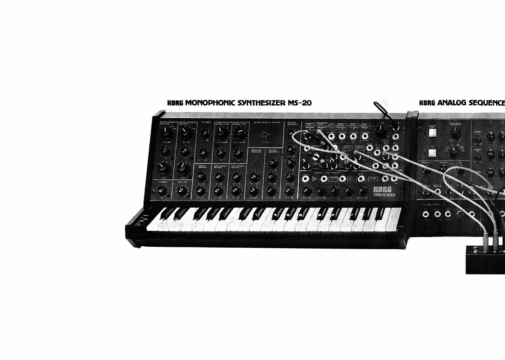


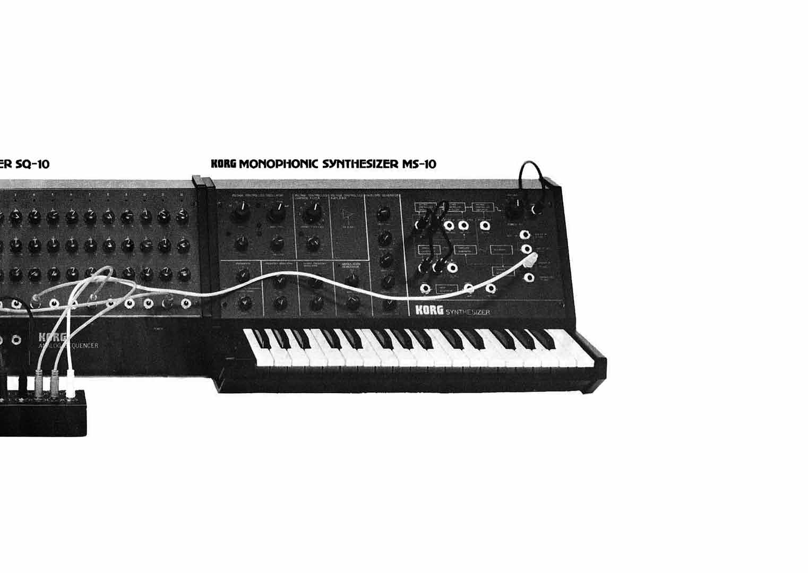


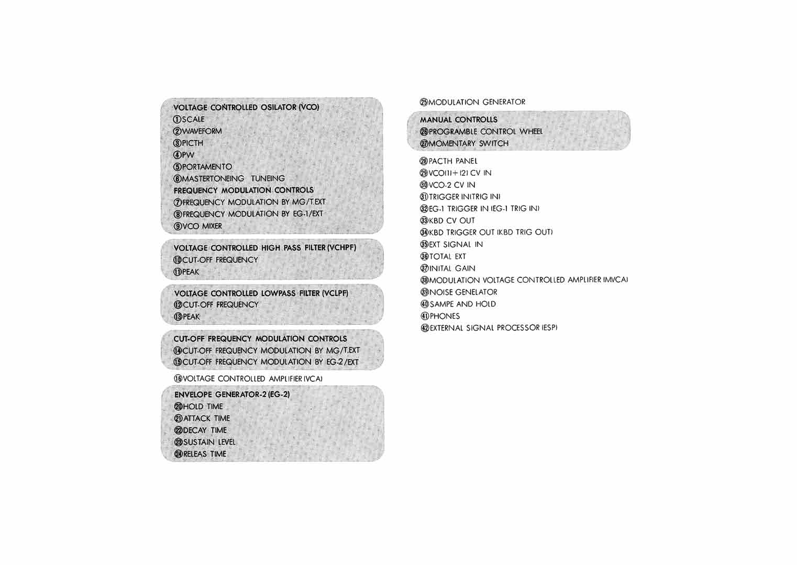


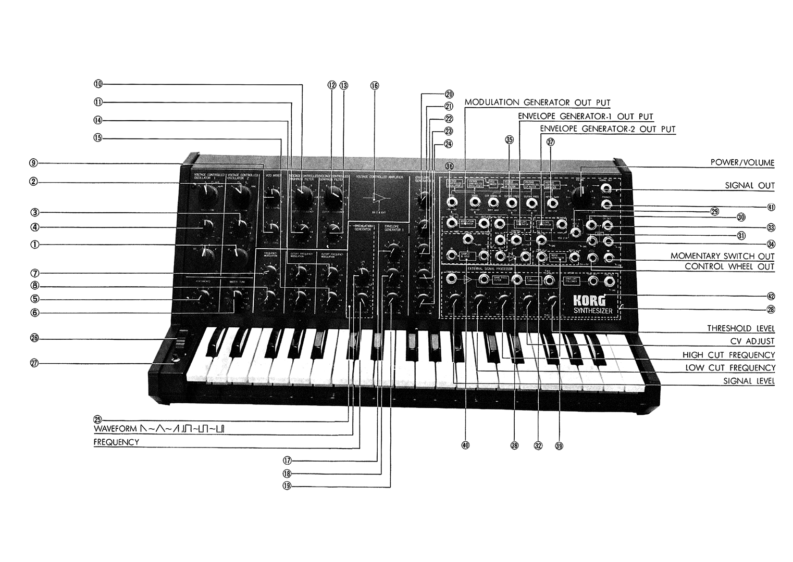


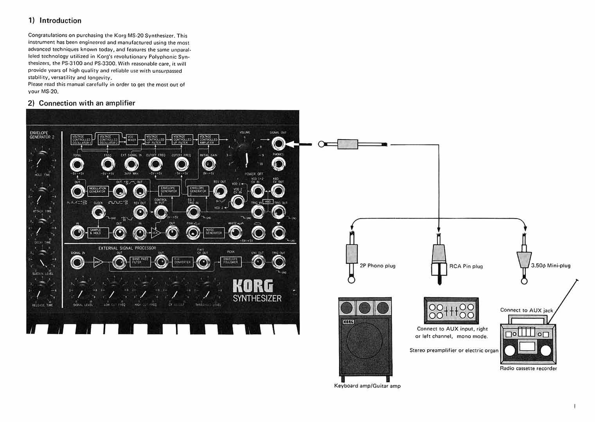


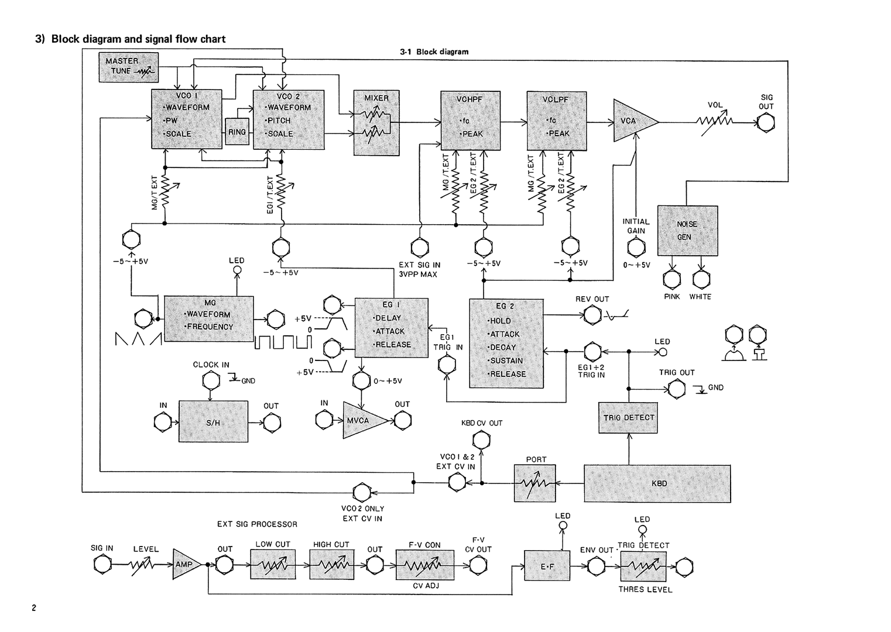


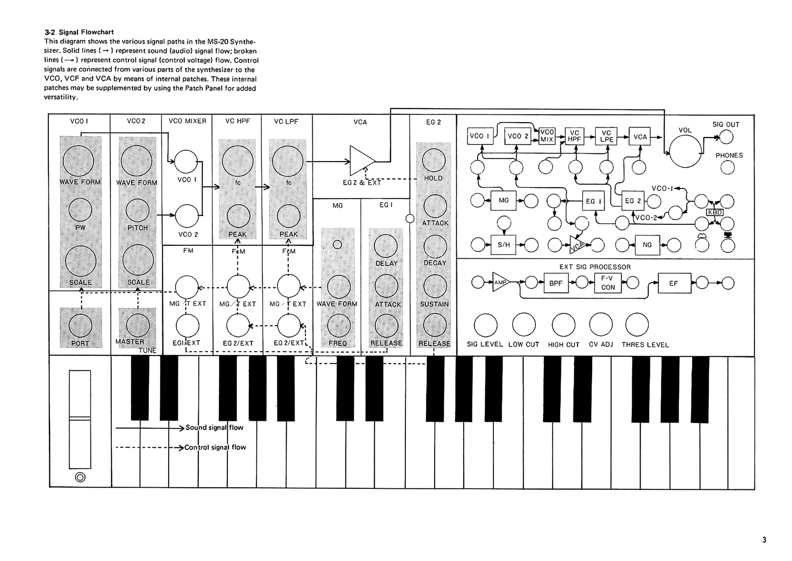


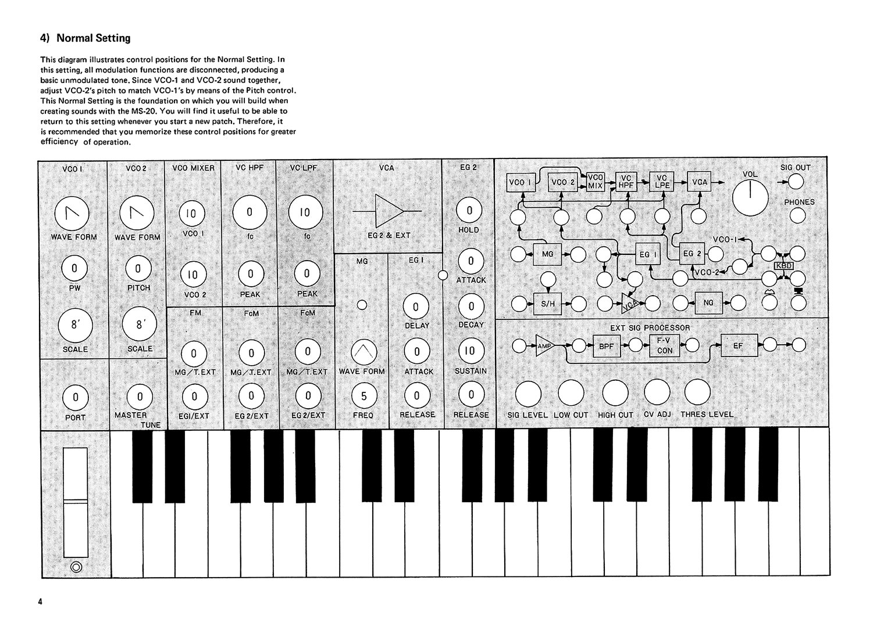


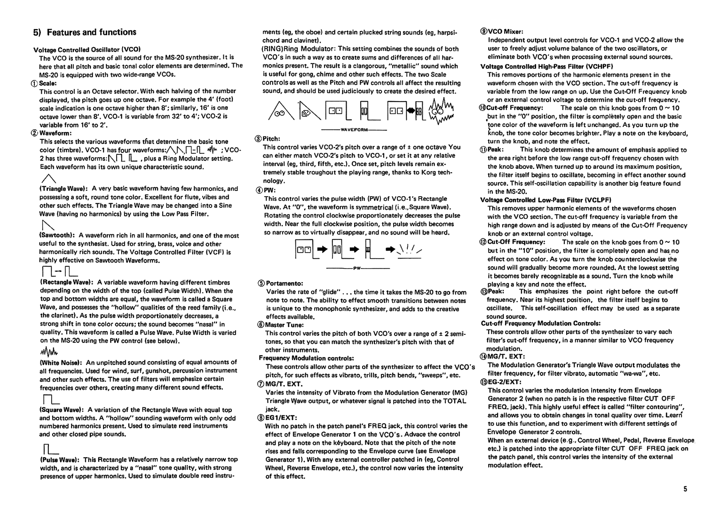


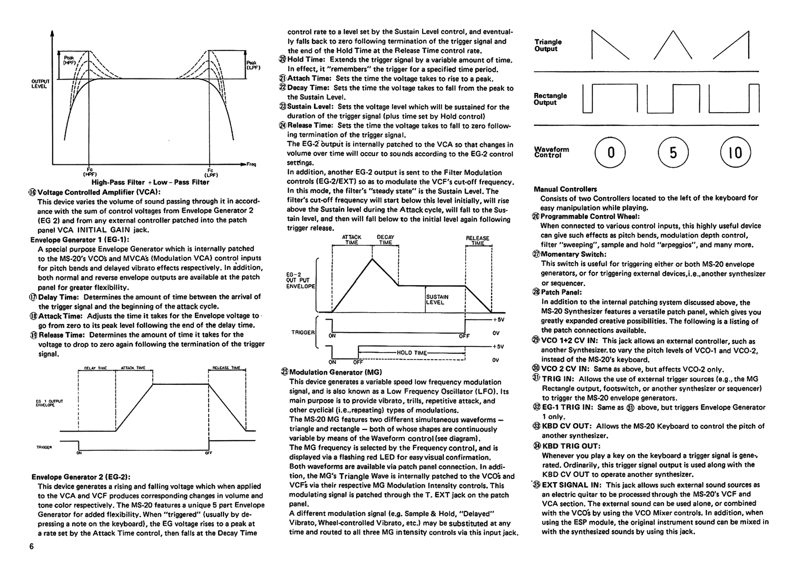


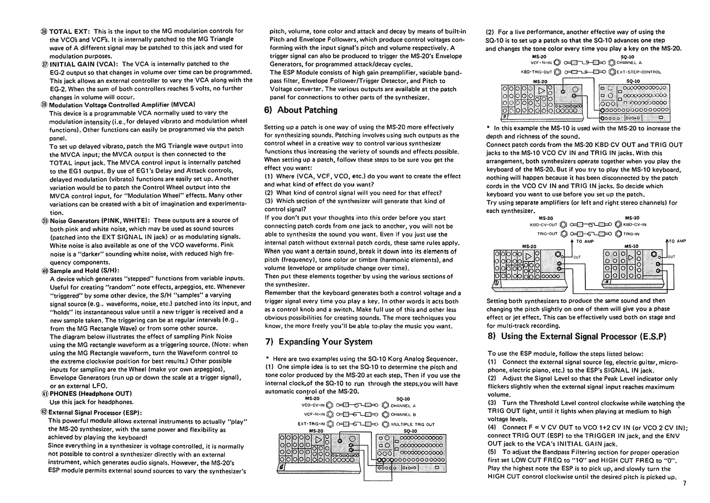


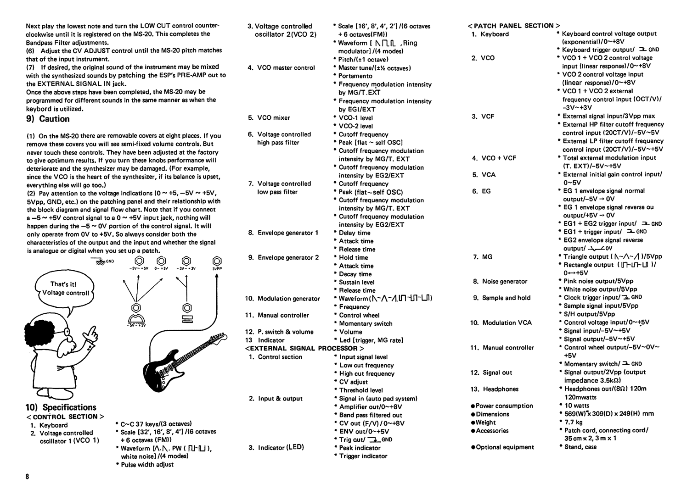


## Conception


### korg + visual interface

Notes:
- Ce qui est bien avec le 

### korg + hack du cable panel (on le voit sur le synthé: c'est le meilleur manuel)


### thinking in components : mon plan d'action


### keyboard


### knobs (oscillateurs et filtres)


### patchboard


## Le clavier

Notes:
- la partie la plus importante
- Celle qui définit la note


###  fréquences en entrée

`$$ f=\frac1{T} $$`
Notes:
- f = le nombre de fois par seconde ou une période arrive
- en Hertz


###  merci wikipedia (todo lien)
<https://en.wikipedia.org/wiki/Piano_key_frequencies>


###  demi-tons, touches noires-blanches

Notes:
- Chiffre magique
- Dans notre musique européenne (ethno-centrisme)
- l'espace entre chaque note est un "demi-ton"


### Nombre magique
`$$ \sqrt[12]{2} $$`<!-- .element: class="fragment" -->
`$$ 2^{1/12} $$`<!-- .element: class="fragment" -->
`$$ 1,0594631 $$`<!-- .element: class="fragment" -->
Notes:
- twelvth root of 2 / racine douzième de deu
- ou 2 puissance 1/12e
- nombre magique


### Une boucle for


###  events click


###  décalage d'octave


###  qui a la source de donnée sur la fréquence / la note ?


## Oscillateurs


###  sinusoide / triangle / sawtooth


###  fréquence + modificateurs


###  code api webaudio


###  mixer deux sources (GainNode)


###  j'ai mis en place deux features, et c'est déjà le bordel


## knob (potentiomètre)


###  trigonométrie


###  problématique de rotation, dans quel sens ?
    - droite => réduire, gauche => augmenter ?
    - ou bien calculer un angle ?


###  ca a l'air simple, mais déjà plein d'events à gérer.


###  machine à états locale au composant


###  comportement-driven-development


###  application sur les filtres


## knob: avancé


###  select vs input/range


###  foutre en l'air sa conception initiale


###  repartir à zéro


###  knob a11y


###  knob select


###  knob range


## Gestion d'état


###  découpage statique/dynamique


###  différents types d'état 
- statique
- de l'interface
- du modèle de données (ici mon graphe audio)
- du serveur


###  signals + computed + effect = win


###  architecture en trois couche au final.
- interface
- effects
- audio-graph


###  state machine (pilot, pas allez trop loin là)


###  interface vs state


###  graphe audio = pas mon ui


###  "paramétrage" = ma donnée


###  dériver l'état vers le graphe audio = effect


## Filtres


### Passe haut
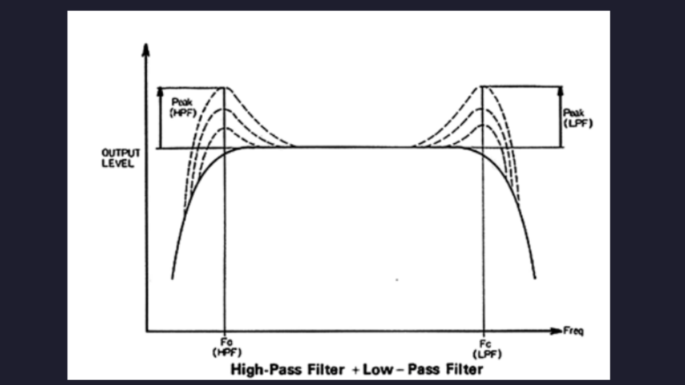

### Passe bas


### Nodes


### peaks


## la ci/cd


###  lint & tests


###  github actions


###  pull-request => deploy sur staging


###  tests reports


###  c'est pas parce que c'est un side projet qu'on va se priver de bonne DX


## Envelope generator


###  revenons au schéma


###  ASDR, attack sustain, release delay.


###  filtres ++


###  démo 


## Accessibilité


###  comment rendre ce bazar accessible?


###  solution: tout est backup par des composants du dom


###  démo désactivation CSS


###  label, output, tester 


## modulation de fréquences


###  ici des maths lourds


###  fourier


###  section à supprimer si pas le temps


## le boss final : cable graphe


###  connections


###  moteur physique: parce que pourquoi pas ?


###  matter.js 


###  longueur du cable 


###  machine a états


## démo finale


## bonus: 


### Les fonctionnalités pas présentées
- settings et indexedb/pwa
- events claviers
- responsive (lol, faire une blague)


### RAF: le reste à faire
- WebMidi ?
- Micro en entrée.
Notes:
- j'ai fait le coeur de métier, mais je pourrais plug plus de features encore


## Conclusion / Leçons
Notes:
- Comme dans plein de chose, il y a des lecons à tirer de cette avanture


###  L'api webaudio
Notes:
- c'est un gros jouet, peu de cas d'usage en dehors de la synthèse sonore
- Vraiment bizarre, on me force à penser en objets, poser des cables
- est-ce que j'ai besoin de savoir utiliser un synthétiseur modulaire avant d'utiliser cette API
- j'ai l'impression que oui


### Les gens sérieux
- font du C (ou du zig) dans ce domaine
- mais: on est là pour le fun 🤡
Notes: 
- pour des raisons de latence
- javascript est assez versatile pour que ça passe
- anything can be re-written in JS


### Scratch an itch
- Grattez vos démangaisons
- Vous avez envie de faire un truc ?
- Faites-le


### Discipline
- penser MVP
- 2h par jour (30 minutes c'est pas assez)

Ça n'empêche pas de 
- faire du code "inutile"
- faites de l'art inutile
- faites de la musique


### Gestion d'état
- que vous le vous le vouliez ou non, vous aurez toujours besoin d'une librairie de..., ou de patterns de.., ou au minimum de penser à la __gestion d'état__.


### Sens de réalisation

- partir de l'interface finale ( ou des maquettes figma ) = 0💩
Notes:
, c'est le meilleur moyen de foirer vos devs front. Orienter sur la donnée.


### Ce n'est pas grave
- si vos side-projects prennent du temps
- si ça n'avance pas
Notes:
- Le pire ennemi.
- Ne peignez pas (trop) la girafe. (yack-shaving)
- s'en rendre compte tôt


### Build in public
- postuler à des sujets au conf, ca fout un coup de pression pour finirs ses side-projects.
Notes:
- j'ai aussi fait le truc en stream.


### Les sujets de niche
- L'informatique c'est super-large
- Tous les sujets sont "tech-isables"
- Les portes sont ouvertes, il faut juste foncer dedans.
Notes:


### Échecs
- les knobs
- pas fini dans les temps
Notes:
- C'est la meta-loi


### Succès ?
- ce talk.
- j'ai appris des trucs
Notes:
- peut-être que ca me servira jamais


### Jean-Pierre Legrand (1956-2020)
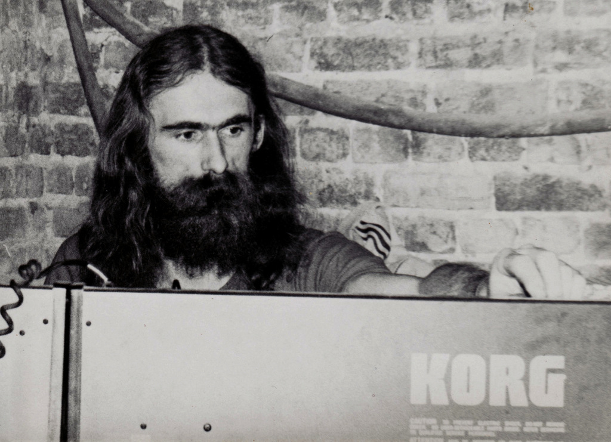
Notes:
- Pour finir, je voudrais dédicacer ce talk à Jean-Pierre
- Merci de m'avoir légué ce synthé
- Et à vous, merci de m'avoir écouté


### Le bon coin
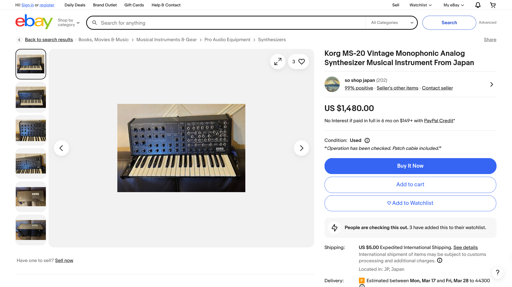
Notes:
- si jamais ca vous intéresse d'avoir un gros synthé chez vous, je le revends.
- Juste pour vous donner une image de l'argus de ce genre de truc


## Merci

// TODO qrcodes et slide de fin
