<!--
---
lang: fr
---
-->
<!-- .slide: data-background-image="images/home-alone.png" data-background-position="bottom left" data-background-size="contain" -->
# Maman, j'ai développé un synthétiseur dans mon navigateur!<!-- .element: style="margin-left: 20%;" -->


## Introduction
Notes:
- un deux un deux? titre.
- Bref, j'ai fait une clownerie
- aujourd'hui je vais vous parler d'un synthétiseur 
- le KORG MS-20, un modèle mythique, sortie en 1978 qui...
- en vrai je vais surtout vous parlez d'un side-project, mais avant:


### Mon oncle Jean-Pierre


Notes:
- lui, c'est mon oncle Jean-pierre.
- enfin, c'était.
- là, il est dans la cave avec le groupe de mon père,
- et il joue du synthétiseur
- on est en mai 1980 ou quelque chose comme ça


### Les araignées malades


Notes:
- avec mon père, qui prends la photo ici.
- ils ont un groupe et ils jouent dans les caves et quelques balles musettes du nord-pas de calais ou de la somme.
- Stan Kogut-Kubiak à la basse
- Daniel Wasilewski à la batterie


### J'en ai un chez moi

Notes:
- Tout ça pour vous dire que je l'ai chez moi
- J'ai grandi avec, j'ai découvert la synthèse sonore et la musique électronique avec.


### Le KORG MS-20


Notes:
- Le MS-20, sorti en 1978, c'est un synthétiseur, un clavier monophonique (une seule note à la fois)
- extrêmement populaire dans les années 80, grand public par rapport aux Moog et synthés existant
- simple à utiliser


### Codepen 2015 / 2016
- des gens font des trucs
- avec l'api WebAudio
Notes:
- je tombe sur des dingueries
- je me dis "ca colle"


### Idée bizarre ou idée de  génie ?
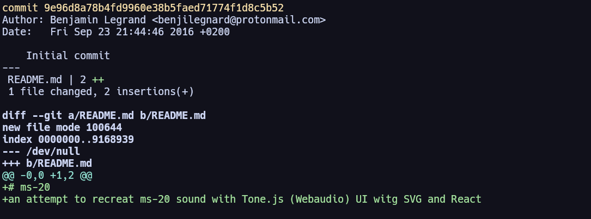
Notes:
- Du coup je me lance dans ce projet bizarre.
- D'implémenter ce synthétiseur spécifiquement.


### Objectifs d'un side-project 
- expérimenter 🧪
- apprendre 👨‍🎓
- s'amuser 🤡
Notes:
- un side-projet de dev, ça ne devrait avoir que deux objectifs
- voire même fait m'arracher les cheveux que je n'ai plus
- Un side project, ca devrait pas avoir d'autres d'objectifs sinon apprendre et s'amuser.


### Stack Technique 
- ⚛️ preact (🚥 + signals)
- 🔈 WebAudio
- ⚡ vite/vitest<!-- .element class="fragment"-->
- 🐼 PandaCSS<!-- .element class="fragment"-->
- 🐙 Github actions<!-- .element class="fragment"-->
- ☁️ Azure static apps<!-- .element class="fragment"-->

Notes:
- faire "propre" quand même
- c'est une excuse pour apprendre
- on peut vouloir utiliser autre chose qu'angular
- sortir de mes compétences


### Hello, my name is...


- __Benjamin Legrand__
- 🧑‍💻Tech lead @ onepoint<!-- .element class="fragment"-->
- 🌐 @benjilegnard<!-- .element class="fragment"-->
- ⌨️ Split keyboards / 🎸 Musicien<!-- .element class="fragment"-->


## La musique


### Sans musique, la vie serait une erreur
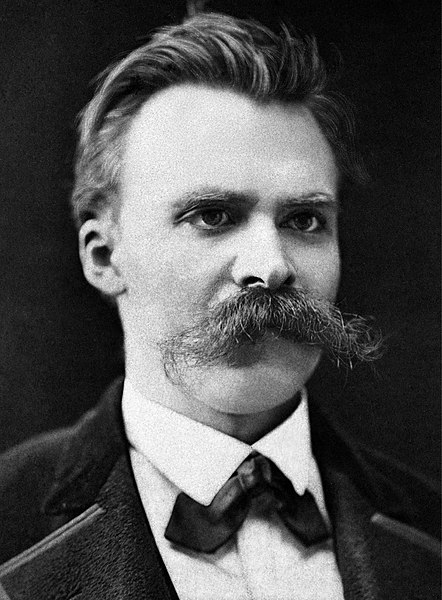
<span class="fragment">Frédéric <span class="fragment strike">Nitch</span></span>
<span class="fragment"><span class="fragment strike">, Nietche</span></span>
<span class="fragment"><span class="fragment strike">, Nietsche</span></span>
<br/>
<span class="fragment">Friedrich Nietzsche</span>


### La musique c'est le silence entre les notes
Claude Debussy
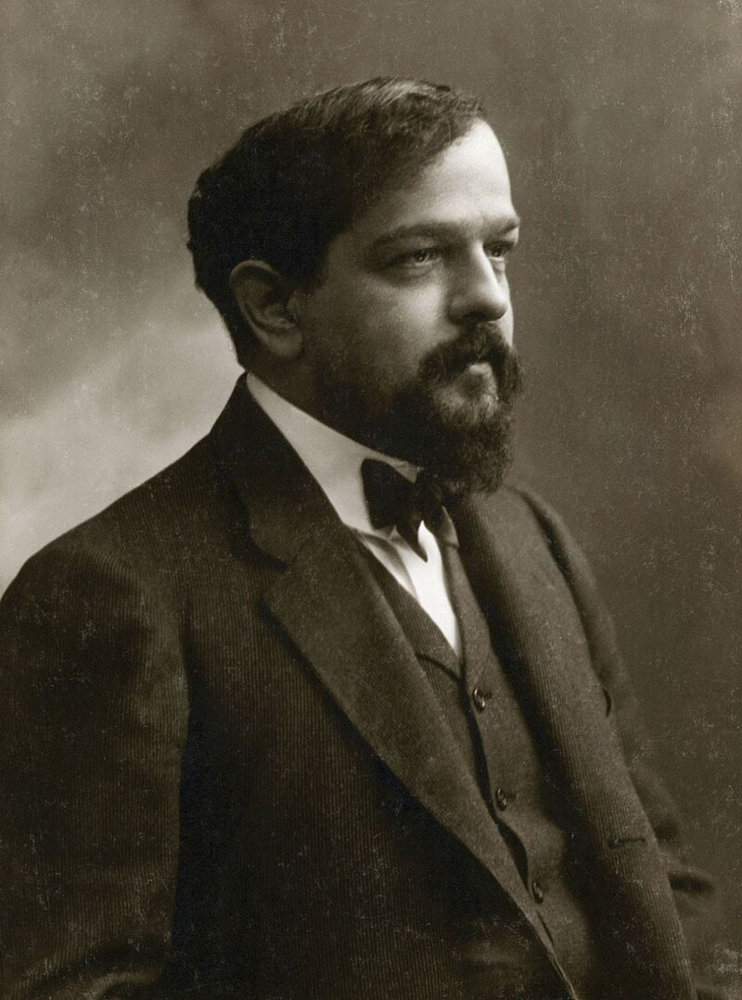
Notes:
- En vrai, il l'avait piqué à mozart
- mais bref.


### Physiquement


Notes:
- Vibration dans l'air => Vos Tympans


### Source: Jackass


Notes:
- sourcez tout.


### En électricité analogique


Un signal alternatif de + ou - 5 volts
Notes:
- le courant va dans un sens, puis dans l'autre
- le korg ms-20 utilise ça, 100% analogique, pas d'électronique
- quand vous branchez des enceintes à une chaine hi-fi, tout ça.
- pour un ordinateur, maintenant, c'est quoi ? 


### La musique, c'est des maths


[On Mathematical Maturity - Thomas Garrity](https://www.youtube.com/watch?v=zHU1xH6Ogs4)<!--.element class="source" -->

Notes:
- Moi après trois bière
- Si vous connaissez pas cette vid elle est trop bien, Introduction à un cours de mathématiques
- Tout peut être décrit par une fonction mathématique, du son de ma voix jusqu'à vos tympans, de la lumière de ce spot jusqu'à vos vieux
- Imaginons que vous vouliez faire une belle onde sonore...


### C'est un peu vague
<div id="trigonometric-circle" class="graphics"></div>
Notes:
- Pour faire une belle onde sonore, on fait une sinusoîdale
- dans ce talk on va parler de maths un peu donc petit rappels de bases, sin(), cos() etc...


### Le son, pour un ordinateur

C'est un tableau de chiffres.
```typescript
[
      0.1428176909685135, -0.009993421845138073,   -0.09681789577007294,
    -0.10563240200281143,  -0.05686311796307564,   0.009973702020943165,
     0.05656611919403076,   0.06287819147109985,    0.03327815607190132,
   -0.009940887801349163, -0.040930114686489105,  -0.044377706944942474,
    -0.02217552810907364,   0.00989505648612976,    0.03252870589494705,
     0.03396344184875488,   0.01567859761416912,  -0.009836316108703613,
    -0.02722390927374363, -0.027226513251662254,  -0.011390355415642262,
    0.009764807298779488,  0.023526398465037346,    0.02247156761586666,
     0.00833441037684679,  -0.00968069676309824,  -0.020768849179148674,
    -0.01890774630010128, -0.006038447842001915,   0.009584184736013412,
    0.018607767298817635,  0.016116628423333168,   0.004246169701218605,
    0.009079087525606155,  0.012990637682378292,   0.009003163315355778,
  -0.0001960703666554764, -0.008924535475671291,  -0.011998359113931656,
   -0.007796374149620533, 0.0009081565658561885,    0.00875935610383749,
    0.011101319454610348,  0.006727392319589853, -0.0015203476650640368,
   -0.008583936840295792, -0.010280984453856945, -0.0057715061120688915
]
```

Notes:
- ok je simplifie à l'extrême -1 : 1
- on va plutôt utiliser des structures toutes faites pour ça. (Buffer)


### Bitrate / Digitalisation
<div id="digitalization" class="graphics"></div>


### Une onde sinusoîdale à 440Hz ?

<div id="sound-test-sine" class="graphics"></div>
Notes:
- tout mes examples là dans mes slides, ils utilisent une API qui est disponible dans mes navigateurs
- l'api WebAudio
- En théorie, un appel de la fonction sin() ou cos()


### Le code derrière le slide:
```typescript
const context = new AudioContext();
const oscillator = context.createOscillator();
oscillator.type = "sine";
oscillator.frequency.value = 440;
oscillator.start();
oscillator.connect(context.destination);
```


### Faites du bruit

Si je remplis un tableau de valeurs aléatoires

```typescript
context = new AudioContext();
const bufferSize = 2 * context.sampleRate;
const noiseBuffer = context.createBuffer(1, bufferSize, context.sampleRate);
const output = noiseBuffer.getChannelData(0);
for (let i = 0; i < bufferSize; i++) {
    output[i] = Math.random() * 2 - 1;
}
```
Notes:
- Pour illustrer mon propos sur le tableau de chiffres.
- Math.random() emphasize.


### Faites du bruit (2)

<div id="sound-test-noise" class="graphics"></div>
Notes:
- parlons donc un peu de cette API.


## L'api WebAudio
Notes:
- pourquoi "ca colle, entre le synthé et ce projet)


### Historique
- 📅 Draft Spec W3C en 2011
- 🪦 Macromedia Flash Player ?<!-- .element class="fragment"-->
- ⬆️ API haut niveau en JavaScript<!-- .element class="fragment"-->
- ⬇️ Bas niveau en C/C++/Assembleur<!-- .element class="fragment"-->
Notes:
- avant cette api, il fallait des plugins externes
- Premier brouillons de specs en 2011
- Implémenté par google en premier
- codepen vers 2015 / 2016


### Supporté par:

Notes:
- Supporté par tous les navigateurs principaux


### Example de base.

```typescript[|2-3|4|5|6|7]
if (window.AudioContext) {
    context = new AudioContext();
    oscillator = context.createOscillator();
    oscillator.type = "sine";
    oscillator.frequency.value = 440;
    oscillator.start();
    oscillator.connect(context.destination);
}
```

Notes:
- ça c'est le code de mon slide avec la sinusoide
- on crée un contexte, puis un oscillateur, on lui assigne une fréquence, et on la connecte à la sortie.
- la méthode createOscillator, elle va créer un objet OscillatorNode();


### AudioNode


Notes:
- ce qu'on manipule dans cette API c'est des noeuds.
- ça hérite d'EventTarget, parce qu'on peut lancer des événements.
- AudioNode la super classe
- plusieurs entrée / sortie
- connect() / disconnect() + channels
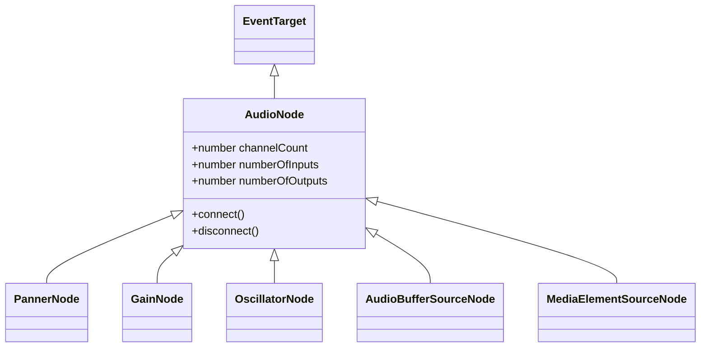


### Des noeuds (au cerveau?)
| | |
| - |  - |
| AnalyserNode | AudioBufferSourceNode |
| AudioWorkletNode | BiquadFilterNode |
| ChannelMergerNode | ChannelSplitterNode |
| ConstantSourceNode | ConvolverNode |
| DelayNode | DynamicsCompressorNode |
| GainNode | IIRFilterNode |
| MediaElementAudioSourceNode | MediaStreamAudioDestinationNode |
| MediaStreamAudioSourceNode | OscillatorNode |
| PannerNode | StereoPannerNode |
| WaveShaperNode |

<a class="source" src="https://developer.mozilla.org/en-US/docs/Web/API/AudioNode" />
Notes:
- vous inquiètez pas on va pas tous les faire
- mon synth il est mono, donc déjà : un seul channel, tout ce qui est stéréo, on oublie


### Graphe de routage audio (example)

Notes:
- tous ces noeuds dans mon code, on va les relier, et faire un graphe dirigé
- connect() / disconnect()


### connect() / disconnect()
```typescript
const context = new AudioContext();
const oscillator = context.createOscillator();
const gain = context.createGainNode();
oscillator.connect(gain);
gain.connect(context.destination);
```


### Rigolo ?


L'API est concue exactement comme on utiliserais un synthétiseur modulaire.

Notes:
- maintenant qu'on a vu ça, revenons en détail sur le MS-20


## Features du MS-20

<abbr title="Read The Fantastic Manual">R.T.F.M.</abbr>
Notes:
- et sérieusement, lisez la doc


## Conception


### Visual interface
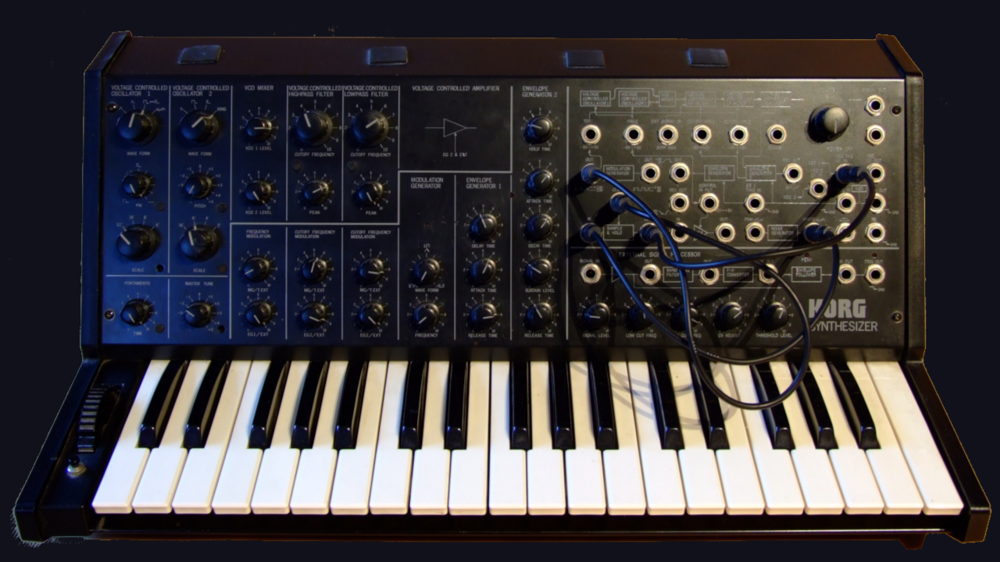

Notes:
- Ce qui est bien avec le korg, c'est qu'il montre visuellement comment les choses fonctionnent ou s'utilisent / meilleur type d'UI


### Penser en composants


### Moar components, MOAR.


Notes:
- en bout de chaine et en tout petit, on a des composants réutilisables


### Types de composants


### Types de composants (2)
| layout | containers | presentational |
| - | - | - |
| Body | Oscillateur1Panel | Knob |
| ControlPanel | Keyboard | Key |
| PatchPanel | | |


### CSS Grid ?
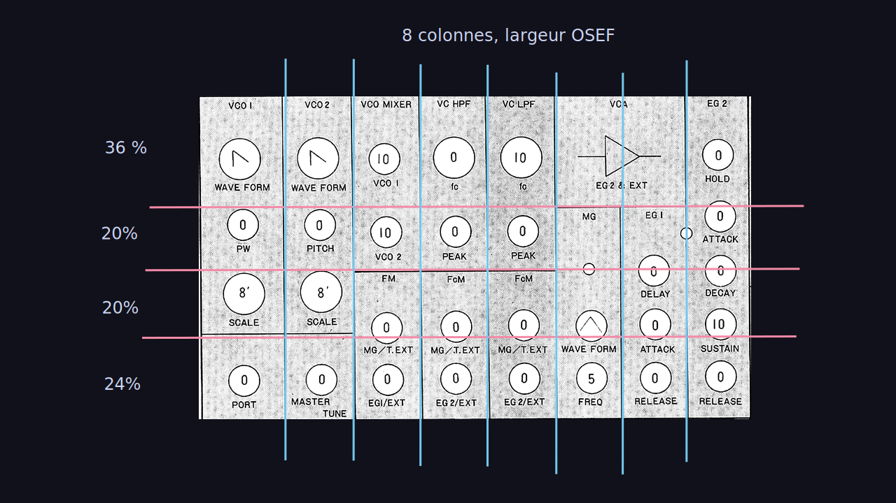

Notes:
- css masonry, fait exactement ce qu'on veut
- css grid pour avoir plus de souplesse sur l'alignement responsive des parties
- flex pour le reste


### Sur le conteneur:

```css[|2|3|4|5-6]
.control-panel {
    display: grid;
    grid-template-columns: repeat(8,1fr);
    grid-template-rows: 35% 20% 20% 25%;
    grid-column-gap: 1px;
    grid-row-gap: 1px;
}
```
Notes:
- je définie grace à l'unité fr 
- en vertical, je détaille mes hauteur de colonnes.
- parfait pour le responsive


### Sur chaque élément:
```css
.oscillator-1-panel {
  grid-area: osc1;
}
.oscillator-2-panel {
  grid-area: osc2;
}
```
Notes:
- ensuite sur chaque élément que je vais positionner
- je nomme ma zonne de grid
- notez que pas de guillemets, c'est une ref css;


### Sur le conteneur:
```css
.control-panel {
    grid-template-areas:
"osc1 osc2 mix hpf  lpf  viz viz eg2" 
"osc1 osc2 mix hpf  lpf  mg  eg1 eg2" 
"osc1 osc2 fm  cfm1 cfm2 mg  eg1 eg2" 
"port mt   fm  cfm1 cfm2 mg  eg1 eg2";
}
```
Notes:
- là ou j'ai mis mes définitions de colonnes.
- je dis aussi quelle area de grid va prendre plusieurs cellules de ma grille


### Le rendu:
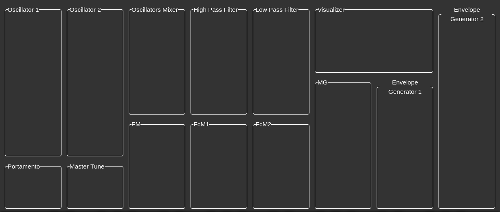
Notes:
- vive CSS Grid
- c'aurait été compliqué ça avant
- Bon on a fait le panneau de contrôle, et la disposition globale.
- mais en vrai le plus intéréssant / par quoi j'ai commencé, c'est le clavier.


## Le clavier


### Ce type de clavier:
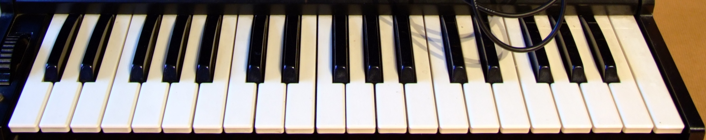
Notes:
- la partie la plus importante
- Celle qui définit la note, la fréquence de mon son.


### Fréquence en entrée

`$$ f=\frac1{T} $$`
Notes:
- juste un rappel sur les Hertz / Fréquences
- f = le nombre de fois par seconde ou une période arrive
- en Hertz
- Donc première quesion, comment je trouve la fréquence d'une touche.


### Merci wikipedia
<div class="graphics" style="overflow-y: scroll;">
    
</div>

<https://en.wikipedia.org/wiki/Piano_key_frequencies>


### Demi-tons, touches noires-blanches

Notes:
- Chiffre magique
- Dans notre musique européenne (ethno-centrisme)
- l'espace entre chaque note est un "demi-ton"


### Nombre magique
`$$ \sqrt[12]{2} $$`<!-- .element: class="fragment" -->
`$$ 2^{1/12} $$`<!-- .element: class="fragment" -->
`$$ 1,0594631 $$`<!-- .element: class="fragment" -->
Notes:
- twelvth root of 2 / racine douzième de deu
- ou 2 puissance 1/12e
- nombre magique


### Calcul des fréquences

Notes:
- Grâce à ça, on calcule


### Décalage d'octaves

Notes:
- Vu qu'on peut calculer.
- 12 semitons par octaves = puissance de deux.


### Décalage d'octaves


### Un octave de base

```typescript
const keysTemplate: string[] = [
	"C",
	"C♯/D♭",
	"D",
	"D♯/E♭",
	"E",
	"F",
	"F♯/G♭",
	"G",
	"G♯/A♭",
	"A",
	"A♯/B♭",
	"B",
];
```


### Répété 3 fois

```typescript
const keys = [
	...keysTemplate.map((note) => `${note}1`),
	...keysTemplate.map((note) => `${note}2`),
	...keysTemplate.map((note) => `${note}3`),
	...keysTemplate.map((note) => `${note}4`),
];
```


### Puis on assigne la fréquence
```typescript[|1|2-3|7-18|5,9-11|13-17]
export const TWELFTH_ROOT_OF_TWO = Math.pow(2, 1 / 12);
// A 440 to the closest C is 9 semitone
const startingNote = 440 - 9 * TWELFTH_ROOT_OF_TWO;

let previousFrequency = startingNote;

const createKeysArray = (): KeyValues[] => keys.map((keyName) => {

	const blackOrWhite = keyName.includes("/");
	const currentFrequency = previousFrequency * TWELFTH_ROOT_OF_TWO;
	previousFrequency = currentFrequency;

	return {
		color: blackOrWhite ? "black" : "white",
		note: keyName,
		freq: currentFrequency,
	};
});
```


### La donnée
```typescript
interface KeyProps {
	color: "black" | "white";
	note: string;
	freq: number;
}
```
Notes:
- ma méthode d'initialisation elle me renvoie ça
- j'ai donc un tableau avec cet objet pour chaque touche


### Composant `keyboard.tsx`
```tsx
export const Keyboard = () => {
	const keyValues = useMemo(() => createKeysArray(), []);
	return (<div>
		{keyValues.map((key) => (
			<Key color={key.color} note={key.note} freq={key.freq}></Key>
		))}
	</div>
	)
};
```
Notes:
- Au final mon composant clavier, ca devient une simple boucle for, qui va passer des infos au composant "Touche"
- je crée ma donnée dans un useMemo pour éviter les re-rendus (fonction component, appelé constamment)
- preact


### Composant `key.tsx`
```tsx
export const Key = (props: KeyProps) => (
    <button
        class={props.color}
        name="key"
        type="button"
        value={props.freq}
        title={props.note}
        onMouseDown={() => {
            oscillator.frequency.value = props.freq;
            oscillator.play();
        }}
        onMouseUp={()=>{
            oscillator.stop();
        }}
    >
        {props.note}
    </button>
);
```


### Positions en CSS
- position relative pour les touches blanches 
- décalage / position absolute pour les noires
```css
.white-key {
    position: relative;
}
.black-key {
    position: absolute;
    left: -5px;
}
```
Notes:
- ou passer, on se l'épargne


### Le rendu:


### Bon.
- Jusqu'ici tout va bien
- C'est joli, mais ça fait rien
Notes:
- ce qui va créé du son, c'est nos: 


## Oscillateurs


### Les contrôles
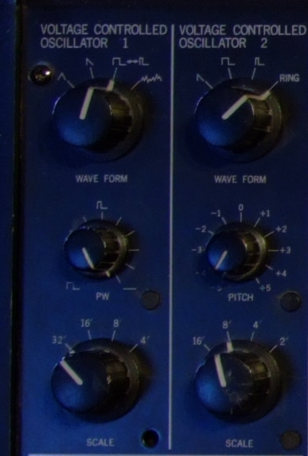
Notes:
- on en a deux principaux sur le ms-20
- et chacun peut-être configuré avec son type d'onde ( timbre) 


### Mise en place du graphe audio
```typescript[|3-4|6-7|9|]
export const audioContext = new AudioContext();

export const oscillator1Node = audioContext.createOscillator();
export const oscillator2Node = audioContext.createOscillator();

export const oscillator1GainNode = audioContext.createGain();
export const oscillator2GainNode = audioContext.createGain();

export const output = audioContext.destination;

oscillator1Node.connect(oscillator1GainNode);
oscillator2Node.connect(oscillator2GainNode);

oscillator1GainNode.connect(output);
oscillator2GainNode.connect(output);

oscillator1Node.start();
oscillator2Node.start();
```
Notes:
- je mets en place un graphe audio
- Et je modifie le composant clé pour qu'il set deux fréquences


### Zoom sur OscillatorNode
```typescript
class OscillatorNode extends AudioNode {
  frequency: number;
  detune: AudioParam;
  type: "sine"|"triangle"|"sawtooth"|"rectangle"|"custom"
}
```
Notes:
- je suis contant, ca va se configurer simplement pour certaines valeurs
- "ca colle", sauf que en fait non,


### Duty Cycle
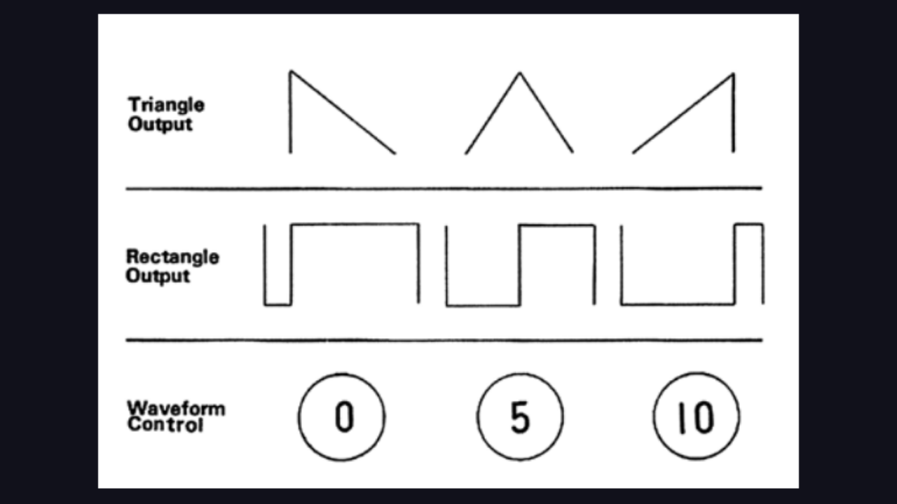

- types d'ondes manquant
- parce que largeur variable
Notes:
- Oscillator.type ne supporte que des types d'ondes "triangle", "sine", "rectangle" et "sawtooth"
- type custom : nécéssite de fournir une "PeriodicWave"


### createPeriodicWave(real, imag)

- real: Array of A terms (cosine)
- imag: Array of B terms (sine)

<a class="source" href="https://developer.mozilla.org/en-US/docs/Web/API/BaseAudioContext/createPeriodicWave">BaseAudioContext.createPeriodicWave</a>
Notes:
- real: tableau de terms cosinus (A)
- image: tableau de terms sinus (B)
- la doc me parle de fournir des coefficients d'une transformation de fourier.


### Attention, des maths :

<div id="fourier-square-wave" class="graphics"></div>


### Transformation de fourier.
`$$ x(t) = A \frac{\tau}{T} + \frac{2A}{\pi} \sum_{n=1}^{\infty} \left(\frac{1}{n} \sin\left(\pi n\frac{\tau}{T}\right) \cos\left(2\pi nft\right)\right) $$`

<https://en.wikipedia.org/wiki/Pulse_wave>
Notes:
- donc là, je pleure, je me roule en boule sur le sol et j'arrête le projet
- pas merci wikipedia


### Joseph Fourier
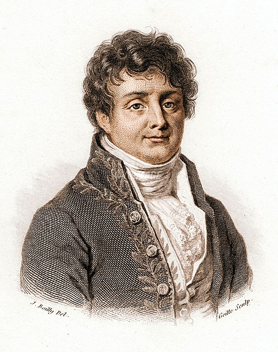


### Scary Math Symbols


### PeriodicWave
```typescript[|1-2|3-4|5-6|7-9|10-14|16-17]
const pulseWidth = 0.5;
const harmonics = 64;
// avoir 0 or 1 values so that there is always sound
let dutyCycle = 0.01 + Math.min(Math.max(pulseWidth, 0)) * 0.98;
let real = new Float32Array(harmonics);
let imag = new Float32Array(harmonics);
// DC offset (first value) is 0
real[0] = 0;
imag[0] = 0;
for (let n = 1; n < harmonics; n++) {
    let theta = Math.PI * dutyCycle * n;
    real[n] = 0; // No cosine components for asymmetric wave
    imag[n] = (2 / (Math.PI * n)) * Math.sin(theta); // Sine coefficients
}

const periodicWave = audioContext.createPeriodicWave(real, imag, { disableNormalization: true });
oscillator2Node.setPeriodicWave(periodicWave);
```
Notes:
- C'est simple hein ? (non, sarcasme)
- Bref, je suis content, je passe à la suite et là, c'est le drame


### Pfiew 😅
Notes:
- J'ai l'air de faire le malin avec ca mais j'en ai chié à trouver le bon truc.
- Et en fait, y'a sûrement moyen de faire mieux.
- Bref, passons à un autre problème de mes doubles oscillateurs.


### Fréquence + échelle

Notes:
- ça abaisse l'octave
- là je tombe sur un problème
- autant je pouvais mapper simplement ma fréquence à un osc
- là il m'en faut deux.


### J'ai mis en place deux features, et c'est déjà le b*****
🍝
Notes:
- je suis déjà bloqué
- problèmes : mon composant clé de clavier commande directement l'oscillateur
- n'a pas connaissance de l'échelle ou des boutons à l'autre bout du 
- Qui a la source de donnée sur la fréquence / la note ?
- Je tombe dans le piège de débutant: mes composants s'occuppent de logique et d'état.


### Signals et gestion d'état
```typescript[|1|3|5-7]
const counter = signal(0);

const oddOrEven = computed(() => counter.value % 2 ? "odd" : "event");

effect(()=>{
    console.log(oddOrEven.value);
});
```
Notes:
- les signals, je développerai pas plus j'ai une conf là dessus.
- mais en gros, apî assez simple, permettant réagir à une valeur encapsulée dans un signal
- dériver des valeurs
- déclencher des effets lor du changement de valeur
- sortir de mes composants la donnée.


### Adapté à mon problème:
```typescript[|1|3|5-7|9-11]
const currentFrequency = signal(440);

const oscillator1Scale = signal<1|2|4|8|16>(2);

const oscillator1Frequency = computed(() => {
  return currentFrequency.value / oscillator1Scale.value);
};

effect(() => {
  oscillatorNode.frequency.value = oscillator1Frequency.value;
});
```
Notes:
- J'ai enfin un vrai cas d'usage pour effet:
- synchronizer avec une lib externe, sans rien faire d'autre du résultat


### Gestion d'état
- Penser au découpage statique/dynamique
- Tout ne va pas dans l'état
Notes:
- et là client/serveur
- mon modèles de données = une autre sortie de mon état


### signals + computed + effect = win
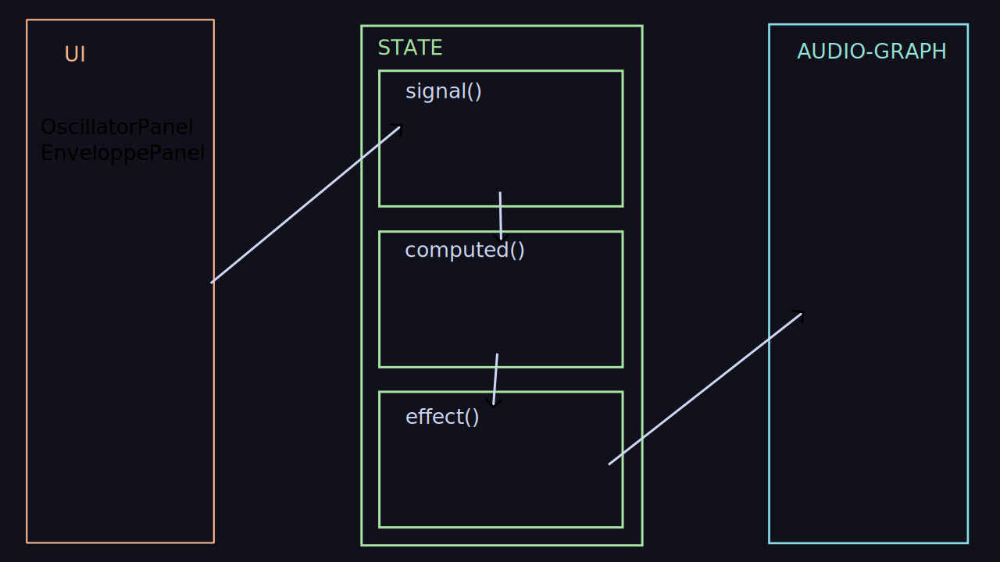
Notes:
- testabilité
- clarté du code.
- je ne teste que mes effets
- Architecture en trois couche au final.
- interface / state / computed+effects / audio-graph
- séparation des responsabilités.
- TODO graphique couches 
- Maintenant qu'on a pris de la hauteur, revenons sur les composants en bout de chaine, le knob


## Les potentiomètres
Notes:
- ou Knob en anglais


### Les trucs ronds, là
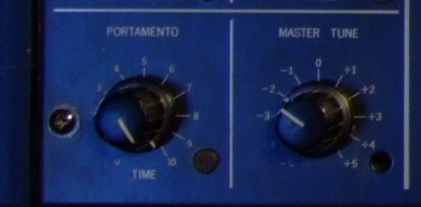
Notes:
- le truc qu'on tourne, vu que je veux que ca ressemble, je me dis, implémentons ça
- et là, encore une galère...


###  trigonométrie (again)

Notes:
- comme souvent dès que ca implique un truc rond, faut sortir la trigo


### Dessiner l'échelle
- trigonométrie: ordre inverse, avoir les coordonnées d'un point à partir d'un angle.


### Problématique de rotation, dans quel sens ?
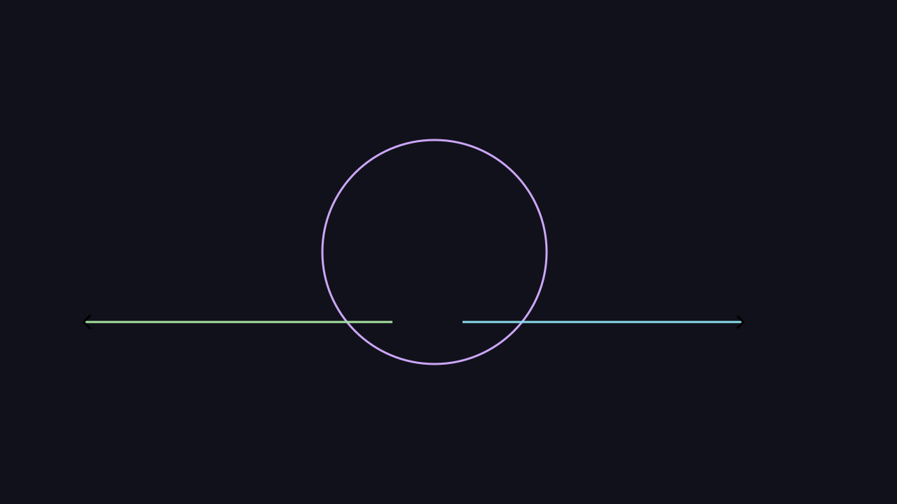
Notes:
- droite => réduire, gauche => augmenter ?
- verticalement?


### Où calculer un angle ?
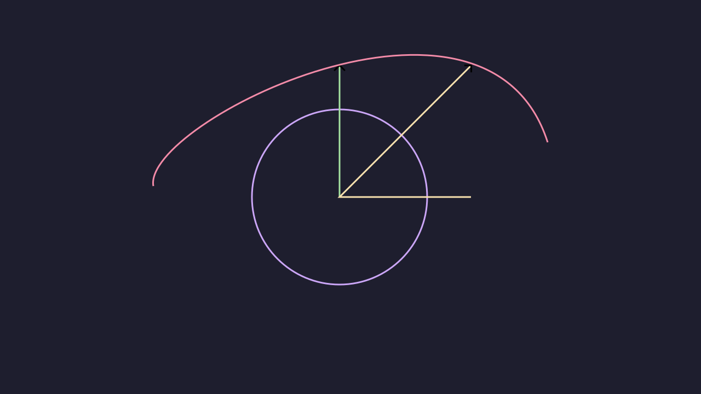
Notes:
- ou bien calculer un angle ?


### Ca a l'air simple, mais déjà plein d'events à gérer.
- mousedown, mousemove, mouseup, change
- conflits avec les autres boutons autour ?


### Solution: phantom element
// TODO animation


### Solution 2: machine à états locale au composant


### En vérité:
- rien de satisfaisant


## Knob: tout refaire


### Select vs input/range


### Foutre en l'air sa conception initiale
Notes:
- ca arrive souvent dans le dev
- faut savoir reconnaître qu'on s'est planté 


### Repartir à zéro
Notes:
- éviter de rajouter de la merde par dessus
- La coulée de lave


### Solutions: Knob, le visuel uniquement
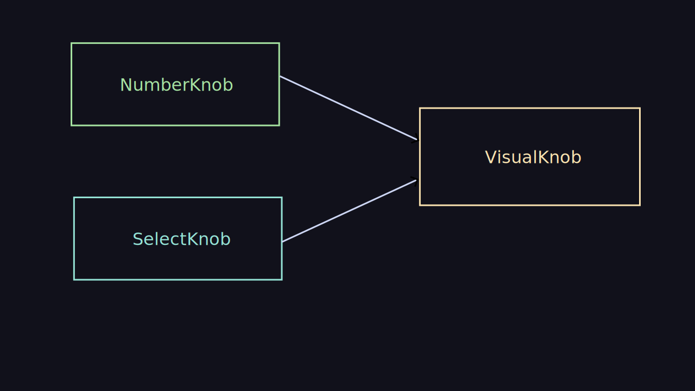


### SelectKnob
```html
<select id="wave-form">
    <option>rectangle</option>
    <option>triangle</option>
    <option>sawtooth</option>
</select>
```
<select id="wave-form">
    <option></option>
    <option>rectangle</option>
    <option>triangle</option>
    <option>sawtooth</option>
</select>


### Knob range
```html
<input
  type="range"
  min="0"
  max="10"
  step="0.1"
  value="5"
/>
```

<input
  type="range"
  min="0"
  max="10"
  step="0.1"
  value="5"
/>


### Pas convaincu ?
- moi non plus
Notes:
- tellement pas convaincu que je suis resté sur le truc de base.


## Filtres


### Les contrôles
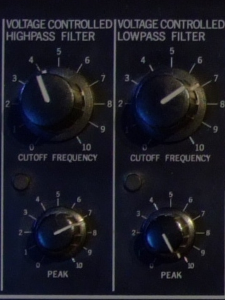

Notes:
- on peut ajuster la fréquence de coupure
- et on peut également ajuster le pic (peak)


### Dans le manuel


Notes:
- si je reviens à mon manuel vous voyez qu'il présente les deux courbes.


### Passe haut

<div id="high-pass-filter" class="graphics"></div>


### Passe bas

<div id="low-pass-filter" class="graphics"></div>


### WebAudio API
```typescript
class BiquadFilterNode extends AudioNode {
    type: "lowpass" | "highpass" | "bandpass";//... etc...
    frequency: AudioParam;
    detune: AudioParam;
    Q: AudioParam;// quality factor ?
    gain: AudioParam;
}
```


### Ajout d'une feature
- toujours pareil
Notes:
- boom boom dans tes oreilles.
- à ce niveau là je commence à être rôdé,
- mise en place dans mon objet d'état
- noeuds dans mon graphe audio
- composants qui change le state
- effect qui synchronize.


## Générateurs d'enveloppe


### Ils étaient deux
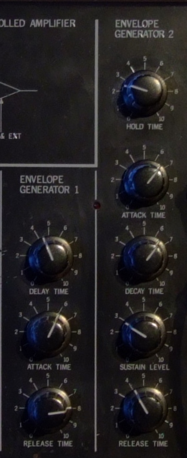
Notes:
- attack time, delay time, release
- hold time, attack decay sustain


### ASDR, attack sustain, release, delay.

<div id="envelope-generator-1" class="graphics"></div>


### Générateur d'envelope 2

<div id="envelope-generator-2" class="graphics"></div>


### AudioParam
```TypeScript
param.value = 0.5;
param.setValueAtTime(0.5, audioContext.currentTime);
param.linearRampToValueAtTime(0,5, audioContext.currentTime + attackTime.value);
```


### Example:
```typescript
effect(() => {
	const { isPlaying } = state;
	const { attackTime, delayTime, releaseTime } =
		state.currentSetting.envelopeGenerator1;
	if (isPlaying.value) {
		envelopeGenerator1GainNode.gain.value = 0;
		envelopeGenerator1GainNode.gain.setValueAtTime(
			0,
			audioContext.currentTime + delayTime.value,
		);
		envelopeGenerator1GainNode.gain.linearRampToValueAtTime(
			1.0,
			audioContext.currentTime + delayTime.value + attackTime.value,
		);
	} else {
		envelopeGenerator1GainNode.gain.linearRampToValueAtTime(
			0,
			audioContext.currentTime + releaseTime.value,
		);
	}
});
```


### Nouveaux problèmes
- ajoute une notion de temps
- refacto nécéssaire avec un signal trigger
Notes:
- là je pourrais arrêter le talk là parce qu'en fait


### Spoiler: j'ai pas fini
Notes:
- suivez moi sur twitch
- lundi / mardi / mercredi 21h-23h
- Dernier apparté avant de terminer parce que dans les trucs qui ont bien marché j'ai:


## Accessibilité
Notes:
- comment rendre ce bazar accessible?
- Malheureusement, ça sera jamais 100% accessible (sourds)


### Tout est backup par des composants du dom
- composant "hors-normes"
- oui mais:

```html
<input type="range" min="0" max="10" step="0.1" />
```
Notes:
- j'ai plein de trucs un peu "funky" le composant knob, bien que visuel, il ne devrait pas réimplémenter de son côté un input type="range"
- réinventer la roue, oui mais pas tout le temps


### Désactivation du CSS
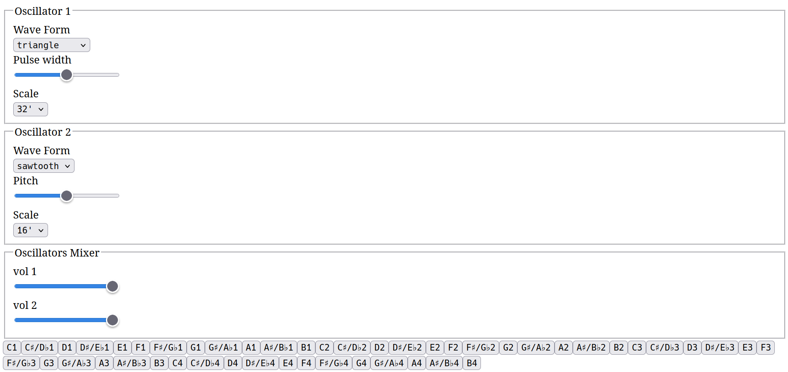
Notes:
- voyez les boutons natif


### Axe dans les tests unitaires
```typescript[|1,7|3,9|16]
import { render } from "@testing-library/preact";
import { App } from "./app";
import axe from "axe-core";

describe("App", () => {
	it("should be axe-essible", async () => {
		const { container } = render(<App />);
		const config = { rules: { "color-contrast": { enabled: false } } };
		const results = await axe.run(container.getRootNode(), config);
		for (const violation of results.violations) {
			console.error(violation.description, violation.helpUrl);
			for (const node of violation.nodes) {
				console.error(node.failureSummary, node.html);
			}
		}
		expect(results.violations).toHaveLength(0);
	});
});
```
Notes:
- un des trucs que j'ai bien fait sur ce projet c'est un test auto avec axe-core
- charge toute l'app sur des projets on peut charger toute une page / écran
- valide que chaque changement ne fait pas régresser
- J'ai pas fini, mais en fait si parce que les parties suivantes.


## Modulation de fréquences


### // TODO
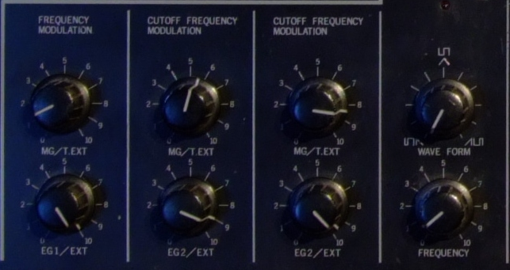
Notes:
- ici des maths lourds
- fourier
- section à supprimer si pas le temps


## Le boss final : le patch panel


### // TODO
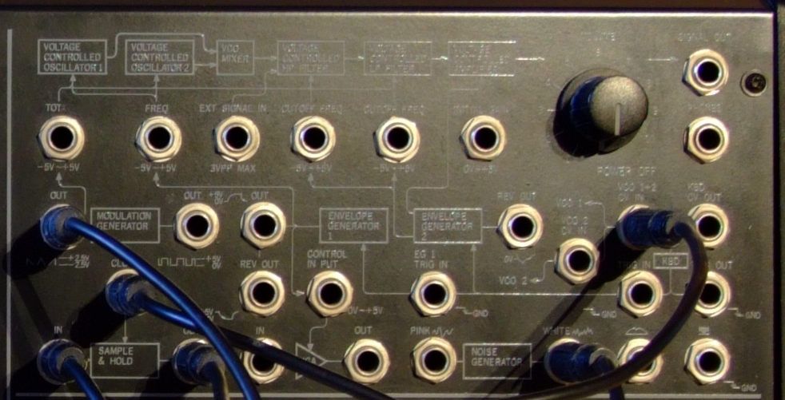


### Connections
- revoir tout le graphe audio


### matter.js 

- Un moteur physique dans un synthétiseur: 
  - parce que pourquoi pas ?
Notes:
- longueur du cable 
- machine a états
- Péter mon dev initial
- rajouter les noeuds de "connection"


### Backup par :
- ?


## démo finale


<!-- .element: data-background-iframe="https://gotloop.github.io/ms-20/" data-background-interactive data-preload -->


### Les fonctionnalités pas ~~présentées~~ finies
- settings et indexedb/pwa
- events claviers ( WebMidi ? )
- responsive...
Notes:
- ajouter une scrollbar.
- j'ai fait le coeur de métier, mais je pourrais plug plus de features encore


## Conclusion / Leçons
Notes:
- Comme dans plein de chose, il y a des lecons à tirer de cette avanture


###  L'api webaudio
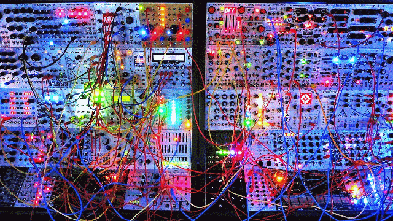
Notes:
- c'est un gros jouet, peu de cas d'usage en dehors de la synthèse sonore
- Vraiment bizarre, on me force à penser en objets, poser des cables
- est-ce que j'ai besoin de savoir utiliser un synthétiseur modulaire avant d'utiliser cette API
- j'ai l'impression que oui


### Les gens sérieux
- font du C (ou du zig) dans ce domaine
- mais: on est là pour le fun 🤡
Notes:
- pour des raisons de latence
- javascript est assez versatile pour que ça passe
- anything can be re-written in JS


### Scratch an itch
- Grattez vos démangaisons
- Vous avez envie de faire un truc ?
- Faites-le
Notes:
- la seule contrainte de décider de s'allouer du temps
- discipline: 2h par jour (30 minutes c'est pas assez)


### C'est la faites.
- faites du code "inutile"
- faites de l'art inutile
- faites de la musique


### Gestion d'état
- que vous le vous le vouliez ou non, vous aurez toujours besoin d'une librairie de..., ou de patterns de.., ou au minimum de penser à la __gestion d'état__.


### Sens de réalisation
- partir de l'interface finale ( ou des maquettes figma ) = 0💩
Notes:
- c'est le meilleur moyen de foirer vos devs front. Orienter sur la donnée.
- conceptualiser, conception avant.


### Ce n'est pas grave
- si vos side-projects prennent du temps
- si ça n'avance pas
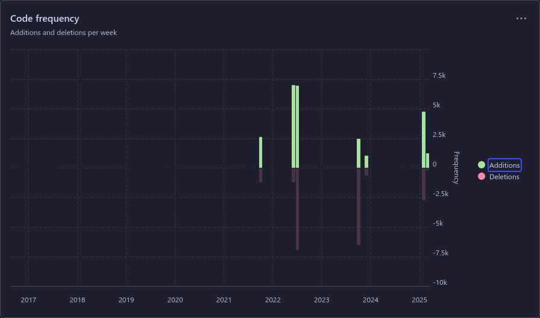
Notes:
- Le pire ennemi.
- Ne peignez pas (trop) la girafe. (yack-shaving)
- s'en rendre compte tôt


### Build in public
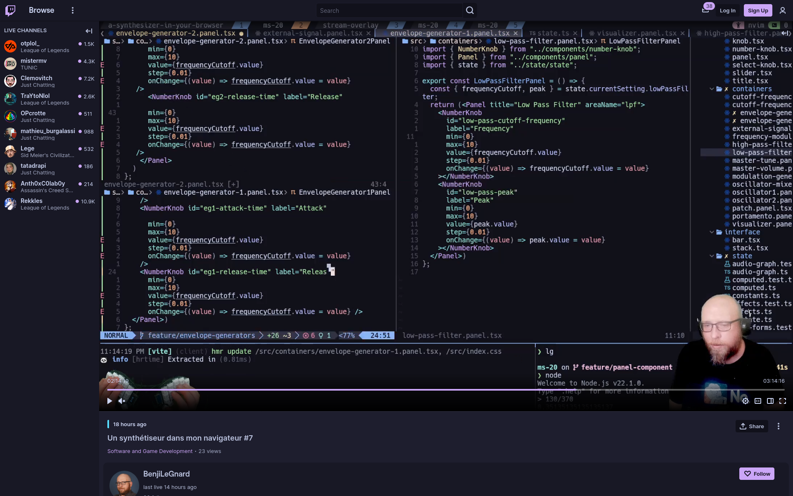

- suivez moi sur [twitch.tv/benjilegnard](https://twitch.tv/benjilegnard) 😏
- et proposez des sujets aux conf's
Notes:
- j'ai aussi fait le truc en stream.
- ca fout un coup de pression pour finirs ses side-projects.


### Les sujets de niche
- L'informatique c'est super-large
- Tous les sujets sont "tech-isables"
- Les portes sont ouvertes, il faut juste foncer dedans.
Notes:
- si vous en avez marre de faire des applications crud
- ou des backoffices insipides.
- Bref, j'en ai terminé.


### Jean-Pierre Legrand (1956-2020)

Notes:
- Pour finir, je voudrais dédicacer ce talk à Jean-Pierre
- Merci de m'avoir légué ce synthé
- Et à vous, merci de m'avoir écouté


### Le bon coin

Notes:
- si jamais ca vous intéresse d'avoir un gros synthé chez vous, je le revends.
- Juste pour vous donner une image de l'argus de ce genre de truc


## Merci
<div style="display:flex; flex-direction: row;justify-content: space-between;">
<a href="https://openfeedback.io/0nEhuP6qarjm0R4pbRG1/2025-03-21/rushwpQL24fyn25fNOz2" target="_blank">
        Feedbacks: <br/>
        
</a>
<a>
Projet:<br/>
</a>
<a>
Slides:<br/>
</a>
</div>

<https://gotloop.github.io/ms-20/>
