<!--
---
lang: fr
---
-->
<!-- .slide: data-background-image="images/home-alone.png" data-background-position="bottom left" data-background-size="contain" -->
# Maman, j'ai développé un synthétiseur dans mon navigateur!<!-- .element: style="margin-left: 20%;" -->


## Introduction
Notes:
- un deux un deux? titre.
- Bref, j'ai fait une clownerie
- aujourd'hui je vais vous parler d'un synthétiseur 
- le KORG MS-20, un modèle mythique, sortie en 1978 qui...
- en vrai je vais surtout vous parlez d'un side-project, mais avant:


### Mon oncle Jean-Pierre


Notes:
- lui, c'est mon oncle Jean-pierre.
- enfin, c'était.
- là, il est dans la cave avec le groupe de mon père,
- et il joue du synthétiseur
- on est en mai 1980 ou quelque chose comme ça


### Les araignées malades


Notes:
- avec mon père, qui prends la photo ici.
- ils ont un groupe et ils jouent dans les caves et quelques balles musettes du nord-pas de calais ou de la somme.
- Stan Kogut-Kubiak à la basse
- Daniel Wasilewski à la batterie


### Le KORG MS-20


Notes:
- Le MS-20, sorti en 1978, c'est un synthétiseur, un clavier monophonique (une seule note à la fois)
- extrêmement populaire dans les années 80, grand public par rapport aux Moog et synthés existant
- simple à utiliser


### J'en ai un chez moi
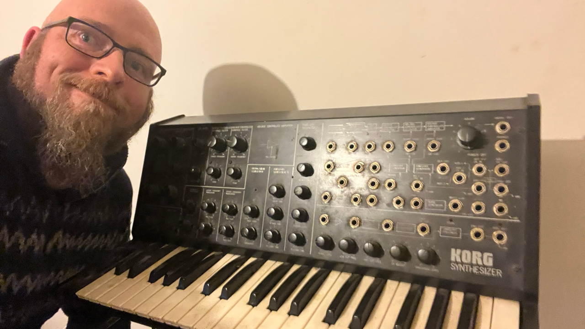
Notes:
- Tout ça pour vous dire que je l'ai chez moi
- J'ai grandi avec, j'ai découvert la synthèse sonore et la musique électronique avec.


### Codepen / 2015 
- des gens font des trucs
- api WebAudio


### Idée bizarre ou idée de  génie ?
- "ça colle"
Notes:
- Du coup je me lance dans ce projet bizarre.
- D'implémenter ce synthétiseur spécifiquement.


### Objectifs d'un Side-project 
- apprendre 👨‍🎓
- s'amuser 🤡
Notes:
- un side-projet de dev, ça ne devrait avoir que deux objectifs
- voire même fait m'arracher les cheveux que je n'ai plus
- Un side project, ca devrait pas avoir d'autres d'objectifs sinon apprendre et s'amuser.


### Stack Technique 
- ⚛️ preact (🚥 + signals)
- 🔈 WebAudio
- 🐼 PandaCSS
- 🐙 github actions
- ⚡ vite/vitest
Notes:
- faire "propre" quand même
- c'est une excuse pour apprendre
- on peut vouloir utiliser autre chose qu'angular
- sortir de mes compétences


### Qui-suis,je ?

- Benjamin Legrand
- Tech lead @ onepoint
- @benjilegnard


## La musique


### Sans musique, la vie serait une erreur
<span class="fragment">Frédéric <span class="fragment strike">Nitch</span></span>
<span class="fragment"><span class="fragment strike">, Nietche</span></span>
<span class="fragment"><span class="fragment strike">, Nietsche</span></span>
<br/>
<span class="fragment">Friedrich Nietzsche</span>


### La musique c'est le silence entre les notes
Claude Debussy

Notes:
- En vrai, il l'avait piqué à mozart
- mais bref.


### Physiquement


Notes:
- Vibration dans l'air => Vos Tympans


### Source:


Notes:
- sourcez tout.


### La musique, c'est des maths


[On Mathematical Maturity - Thomas Garrity](https://www.youtube.com/watch?v=zHU1xH6Ogs4)<!--.element class="source" -->

Notes:
- Moi après trois bière
- Si vous connaissez pas cette vid elle est trop bien, Introduction à un cours de mathématiques
- Tout peut être décrit par une fonction mathématique
- Imaginons que vous vouliez faire une belle onde sonore...


### C'est un peu vague
<div id="trigonometric-circle" class="graphics"></div>
Notes:
- Pour faire une belle onde sonore, on fait une sinusoîdale
- dans ce talk on va parler de maths un peu donc petit rappels de bases, sin(), cos() etc...


### En électricité analogique
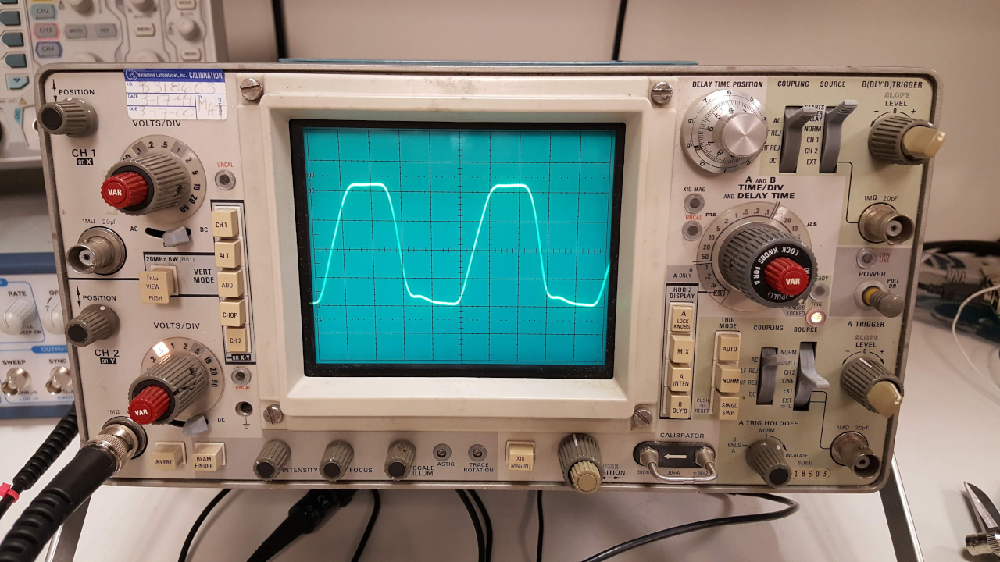
Un signal alternatif de + ou - 5 volts
Notes:
- le courant va dans un sens, puis dans l'autre
- le korg ms-20 utilise ça, 100% analogique, pas d'électronique
- quand vous branchez des enceintes à une chaine hi-fi, tout ça.
- pour un ordinateur, maintenant, c'est quoi ? 


### Le son, pour un ordinateur

C'est un tableau de chiffres.
```typescript
[
      0.1428176909685135, -0.009993421845138073,   -0.09681789577007294,
    -0.10563240200281143,  -0.05686311796307564,   0.009973702020943165,
     0.05656611919403076,   0.06287819147109985,    0.03327815607190132,
   -0.009940887801349163, -0.040930114686489105,  -0.044377706944942474,
    -0.02217552810907364,   0.00989505648612976,    0.03252870589494705,
     0.03396344184875488,   0.01567859761416912,  -0.009836316108703613,
    -0.02722390927374363, -0.027226513251662254,  -0.011390355415642262,
    0.009764807298779488,  0.023526398465037346,    0.02247156761586666,
     0.00833441037684679,  -0.00968069676309824,  -0.020768849179148674,
    -0.01890774630010128, -0.006038447842001915,   0.009584184736013412,
    0.018607767298817635,  0.016116628423333168,   0.004246169701218605,
   -0.009475498460233212, -0.016848448663949966,  -0.013856206089258194,
   -0.002806499134749174,  0.009354893118143082,   0.015372405759990215,
     0.01197686418890953, 0.0016246286686509848,   -0.00922265276312828,
   -0.014103495515882969, -0.010381207801401615, -0.0006380616687238216,
    0.009079087525606155,  0.012990637682378292,   0.009003163315355778,
  -0.0001960703666554764, -0.008924535475671291,  -0.011998359113931656,
   -0.007796374149620533, 0.0009081565658561885,    0.00875935610383749,
    0.011101319454610348,  0.006727392319589853, -0.0015203476650640368,
   -0.008583936840295792, -0.010280984453856945, -0.0057715061120688915
]
```

Notes:
- ok je simplifie à l'extrême -1 : 1
- on va plutôt utiliser des structures toutes faites pour ça. (Buffer)


### Bitrate / Digitalisation
<div id="digitalization" class="graphics"></div>


### Attention, des maths :

<div id="fourier-square-wave" class="graphics"></div>


<div id="wave-form-periodic-wave" class="graphics"></div>


<div id="envelope-generator-1" class="graphics"></div>


<div id="envelope-generator-2" class="graphics"></div>


<div id="high-pass-filter" class="graphics"></div>


<div id="low-pass-filter" class="graphics"></div>


<div id="audio-player" class="graphics"></div>


### Onde + digitalisation
// todo, onde avec échantillonage


### Code naîf.


### Une onde sinusoîdale à 440Hz ?

<div id="sound-test-sine" class="graphics"></div>
Notes:
- tout mes examples là dans mes slides, ils utilisent une API qui est disponible dans mes navigateurs
- l'api WebAudio


### Faites du bruit

Si je remplis un tableau de valeur aléatoires

```typescript
context = new AudioContext();
const bufferSize = 2 * context.sampleRate;
const noiseBuffer = context.createBuffer(1, bufferSize, context.sampleRate);
const output = noiseBuffer.getChannelData(0);
for (let i = 0; i < bufferSize; i++) {
    output[i] = Math.random() * 2 - 1;
}
```
Notes:
- Math.random() emphasize.


### Faites du bruit (2)

<div id="sound-test-noise" class="graphics"></div>
Notes:
- parlons donc un peu de cette API.


## L'api WebAudio
Notes:
- pourquoi "ca colle, entre le synthé et ce projet)


### Historique
- Draft Spec W3C en 2011 📆
- Remember Flash ? 🪦
- High-level en JS
- implementation en C/C++/Assembleur
Notes:
- avant cette api, il fallait des plugins externes
- Premier brouillons de specs en 2011
- Implémenté par google en premier
- codepen vers 2015 / 2016


### Baseline
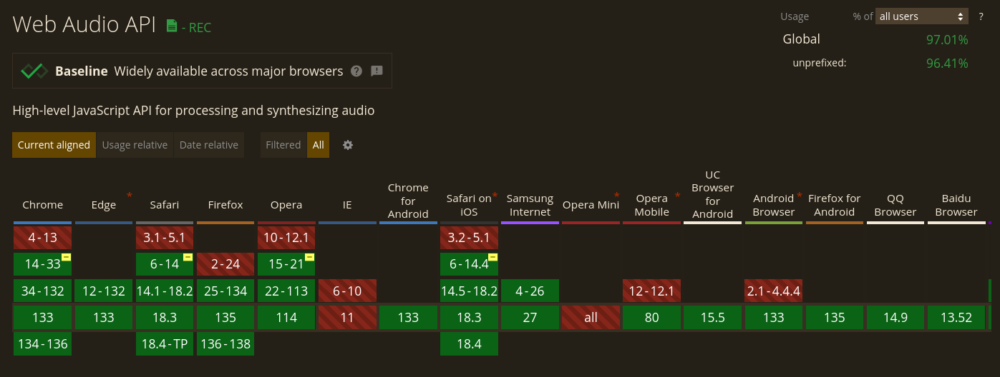
Notes:
- Supporté par tous les navigateurs principaux


### Example de base.

```typescript[|2-3|4|5|6|7]
if (window.AudioContext) {
    context = new AudioContext();
    oscillator = context.createOscillator();
    oscillator.type = "sine";
    oscillator.frequency.value = 440;
    oscillator.start();
    oscillator.connect(context.destination);
}
```

Notes:
- ça c'est le code de mon slide avec la sinusoide
- on crée un contexte, puis un oscillateur, on lui assigne une fréquence, et on la connecte à la sortie.
- la méthode createOscillator, elle va créer un objet OscillatorNode();


### AudioNode
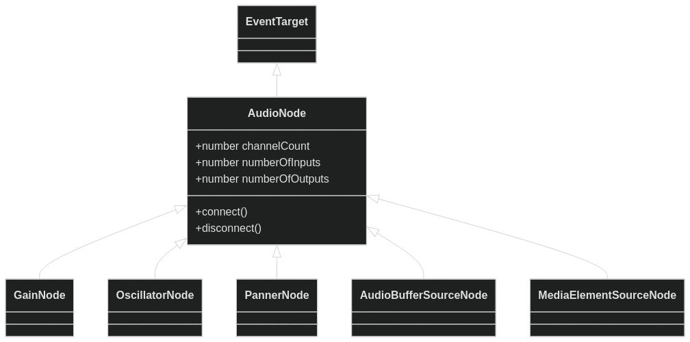

Notes:
- ce qu'on manipule dans cette API c'est des noeuds.
- ça hérite d'EventTarget, parce qu'on peut lancer des événements.
- AudioNode la super classe
- plusieurs entrée / sortie
- connect() / disconnect() + channels
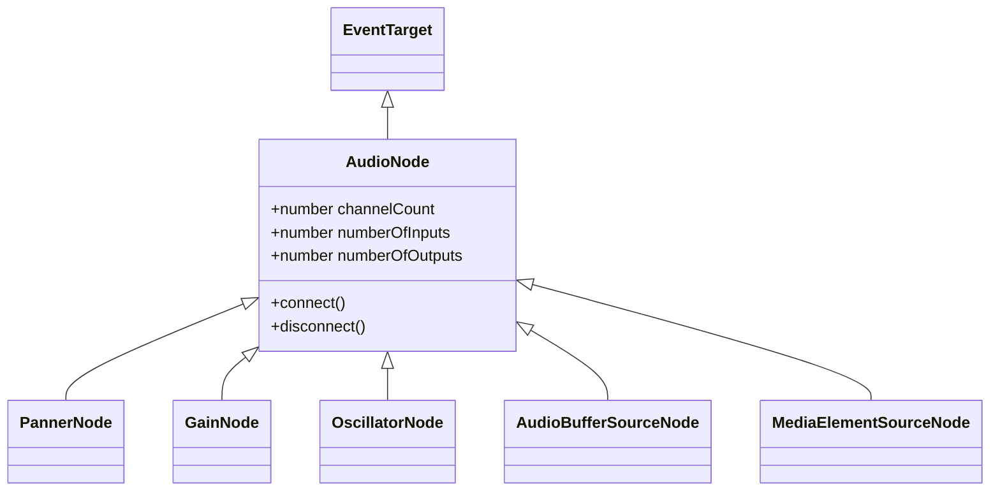


### Des noeuds (au cerveau?)

```
AnalyserNode
AudioBufferSourceNode
AudioWorkletNode
BiquadFilterNode
ChannelMergerNode
ChannelSplitterNode
ConstantSourceNode
ConvolverNode
DelayNode
DynamicsCompressorNode
GainNode
IIRFilterNode
MediaElementAudioSourceNode
MediaStreamAudioDestinationNode
MediaStreamAudioSourceNode
OscillatorNode
PannerNode
StereoPannerNode
WaveShaperNode
```
<https://developer.mozilla.org/en-US/docs/Web/API/AudioNode>
Notes:
- vous inquiètez pas on va pas tous les faire
- mon synth il est mono, donc déjà : un seul channel, tout ce qui est stéréo, on oublie


### Graphe de routage audio (example)
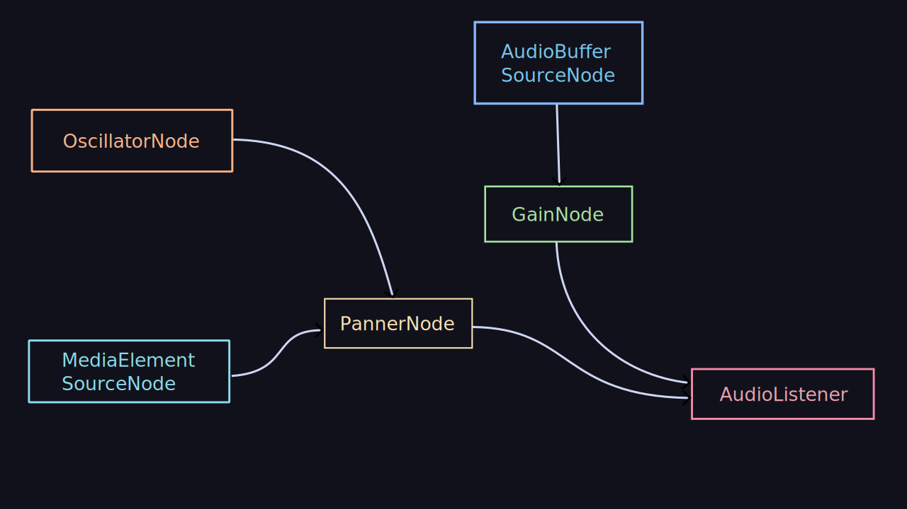
Notes:
- tous ces noeuds dans mon code, on va les relier, et faire un graphe dirigé
- connect() / disconnect()


### connect() / disconnect()
```typescript
const context = new AudioContext();
const oscillator = context.createOscillator();
const gain = context.createGainNode();
oscillator.connect(gain);
gain.connect(context.destination);
```


### Rigolo ?

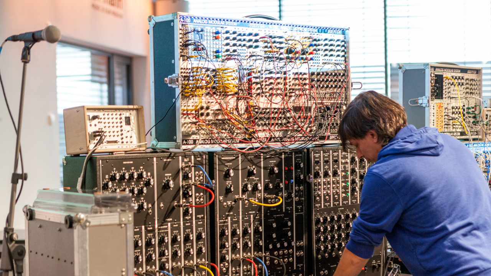

L'API est concue exactement comme on utiliserais un synthétiseur modulaire.

Notes:
- maintenant qu'on a vu ça, revenons en détail sur le MS-20


## Features du MS-20

<abbr title="Read The Fantastic Manual">R.T.F.M.</abbr>
Notes:
- et sérieusement, lisez la doc


## Conception


### Visual interface


Notes:
- Ce qui est bien avec le korg, c'est qu'il montre visuellement comment les choses fonctionnent ou s'utilisent / meilleur type d'UI


### Penser en composants

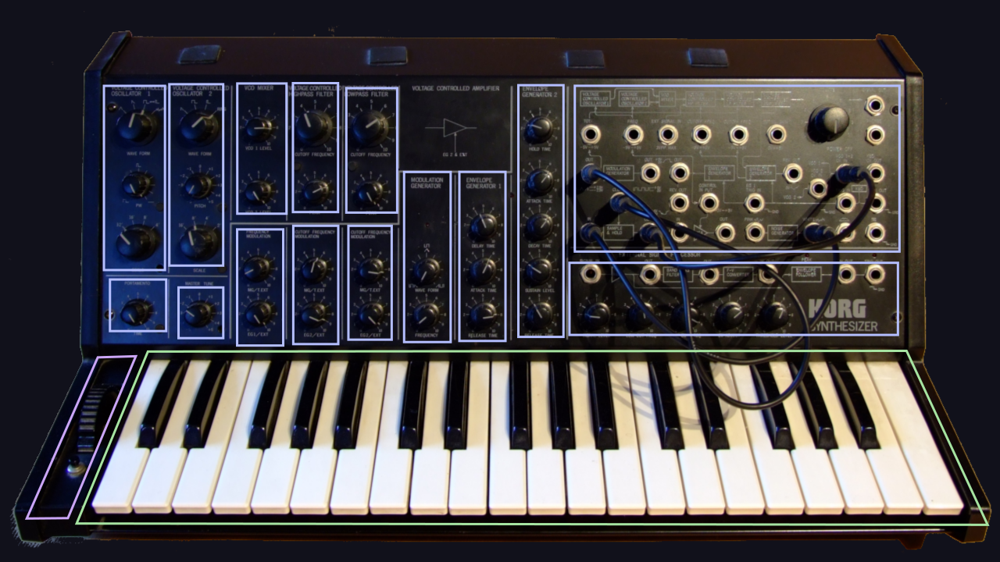


### Moar components, MOAR.

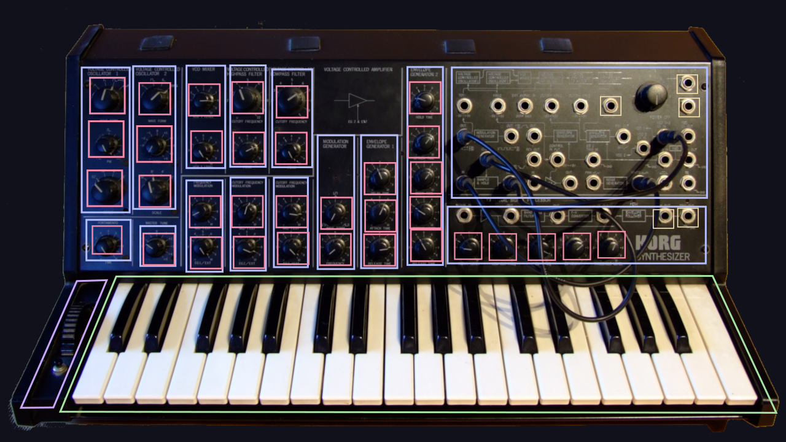
Notes:
- en bout de chaine et en tout petit, on a des composants réutilisables


### UI
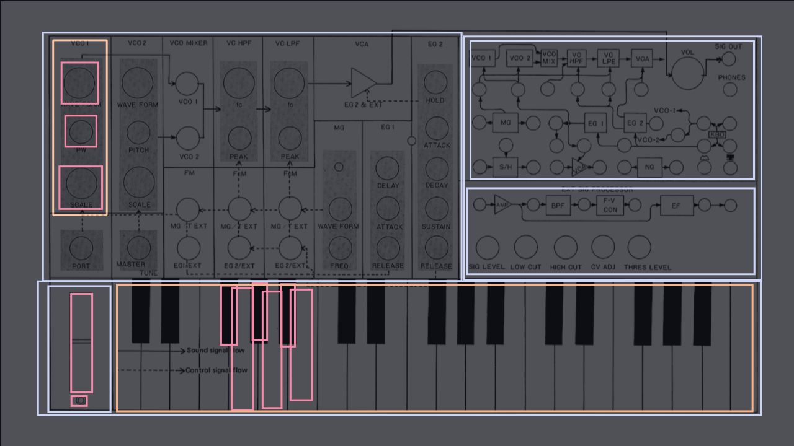

layout / containers / presentational


### Masonry ?
- css masonry, fait exactement ce qu'on veut
- css grid pour avoir plus de souplesse sur l'alignement responsive des parties
- flex pour le reste
// TODO code example
Notes:
- Bon, maintenant qu'on a 
- évidemment, on va commencer par le plus important.


## Le clavier

Notes:
- la partie la plus importante
- Celle qui définit la note, la fréquence de mon son.


### Fréquence en entrée

`$$ f=\frac1{T} $$`
Notes:
- juste un rappel sur les Hertz / Fréquences
- f = le nombre de fois par seconde ou une période arrive
- en Hertz
- Donc première quesion, comment je trouve la fréquence d'une touche.


### Merci wikipedia
<div class="graphics" style="overflow-y: scroll;">
    
</div>

<https://en.wikipedia.org/wiki/Piano_key_frequencies>


### Demi-tons, touches noires-blanches
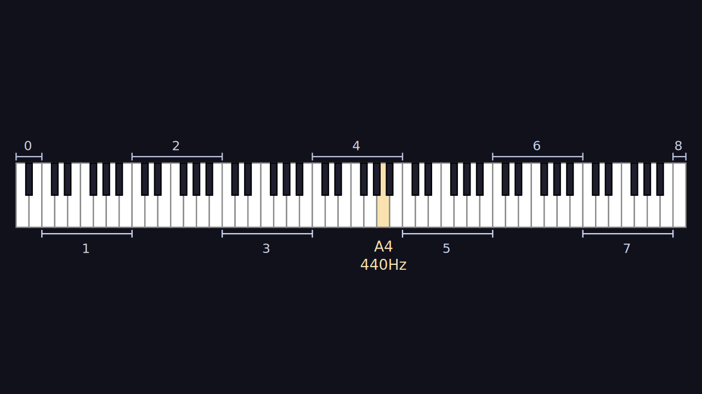
Notes:
- Chiffre magique
- Dans notre musique européenne (ethno-centrisme)
- l'espace entre chaque note est un "demi-ton"


### Nombre magique
`$$ \sqrt[12]{2} $$`<!-- .element: class="fragment" -->
`$$ 2^{1/12} $$`<!-- .element: class="fragment" -->
`$$ 1,0594631 $$`<!-- .element: class="fragment" -->
Notes:
- twelvth root of 2 / racine douzième de deu
- ou 2 puissance 1/12e
- nombre magique


### Calcul des fréquences
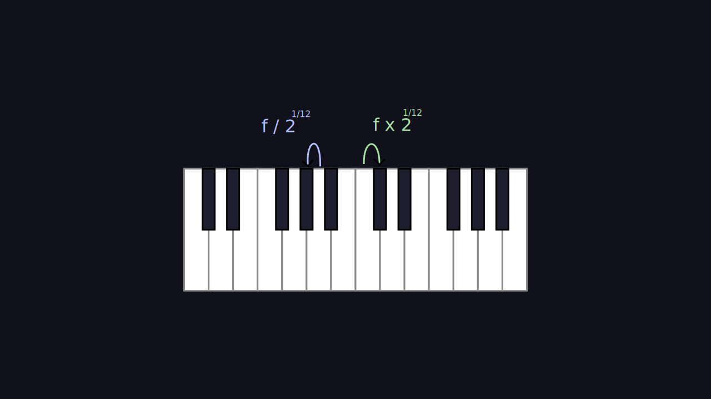
Notes:
- Grâce à ça, on calcule


### Décalage d'octaves

Notes:
- Vu qu'on peut calculer.
- 12 semitons par octaves = puissance de deux.


### Décalage d'octaves
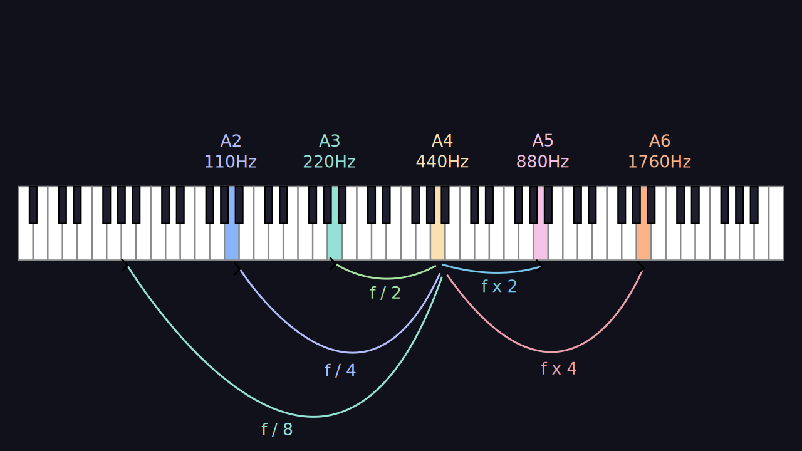


### Un octave de base

```typescript
const keysTemplate: string[] = [
	"C",
	"C♯/D♭",
	"D",
	"D♯/E♭",
	"E",
	"F",
	"F♯/G♭",
	"G",
	"G♯/A♭",
	"A",
	"A♯/B♭",
	"B",
];
```


### Répété 3 fois

```typescript
const keys = [
	...keysTemplate.map((note) => `${note}1`),
	...keysTemplate.map((note) => `${note}2`),
	...keysTemplate.map((note) => `${note}3`),
	...keysTemplate.map((note) => `${note}4`),
];
```


### Puis on assigne la fréquence
```typescript[|1|2-3|7-18|5,9-11|13-17]
export const TWELFTH_ROOT_OF_TWO = Math.pow(2, 1 / 12);
// A 440 to the closest C is 9 semitone
const startingNote = 440 - 9 * TWELFTH_ROOT_OF_TWO;

let previousFrequency = startingNote;

const createKeysArray = (): KeyValues[] => keys.map((keyName) => {

	const blackOrWhite = keyName.includes("/");
	const currentFrequency = previousFrequency * TWELFTH_ROOT_OF_TWO;
	previousFrequency = currentFrequency;

	return {
		color: blackOrWhite ? "black" : "white",
		note: keyName,
		freq: currentFrequency,
	};
});
```


### La donnée
```typescript
interface KeyProps {
	color: "black" | "white";
	note: string;
	freq: number;
}
```
Notes:
- j'ai donc un tableau avec cet objet pour chaque touche


### Une boucle for
`keyboard.tsx`
```typescript
export const Keyboard = () => {
	const keyValues = useMemo(() => createKeysArray(), []);
	return (<div>
		{keyValues.map((key) => (
			<Key color={key.color} note={key.note} freq={key.freq}></Key>
		))}
	</div>
	)
};
```
Notes:
- Au final mon composant clavier, ca devient une simple boucle for, qui va passer des infos au composant "Touche"
- je crée ma donnée dans un useMemo pour éviter les re-rendus (fonction component, appelé constamment)
- preact


### Events click
`key.tsx`
```typescript
export const Key = (props: KeyProps) => {
	return (
		<button
            class={props.color}
			name="key"
			type="button"
			value={props.freq}
			title={props.note}
			onClick={() => {
                oscillator.frequency.value = props.freq
            }}
		>
			{props.note}
		</button>
	);
};
```


### Position en CSS
- décalage / position absolute pour les noires
- relative pour les blanches 
(TODO code example)


### Bon.
- jusqu'ici tout va bien, c'est joli, mais ça fait rien
Notes:
- ce qui va créé du son,


## Oscillateurs

### Les contrôles
// todo zoom sur la partie
Notes: 

### sinusoide / triangle / sawtooth
- les types d'ondes sonores


### API
`OscillatorNode`
- frequency
- detune
- type 


### Fréquence + modificateurs
- potard "échelle"
Notes:
ça abaisse l'octave


### Mixer deux sources (GainNode)
```typescript[|3-4|6-7|9|]
export const audioContext = new AudioContext();

export const oscillator1Node = audioContext.createOscillator();
export const oscillator2Node = audioContext.createOscillator();

export const oscillator1GainNode = audioContext.createGain();
export const oscillator2GainNode = audioContext.createGain();

export const output = audioContext.destination;

oscillator1Node.connect(oscillator1GainNode);
oscillator2Node.connect(oscillator2GainNode);

oscillator1GainNode.connect(output);
oscillator2GainNode.connect(output);

oscillator1Node.start();
oscillator2Node.start();
```


### Code api webaudio
- ne supporte que des types d'ondes "triangle", "sine", "rectangle" et "sawtooth"
- type custom : nécéssite de fournir une 
// TODO pulse-wave interactive slide
<div id="pulse-width-waves" class="graphics"/>


### Transformation de fourier.
`$$ x(t) = A \frac{\tau}{T} + \frac{2A}{\pi} \sum_{n=1}^{\infty} \left(\frac{1}{n} \sin\left(\pi n\frac{\tau}{T}\right) \cos\left(2\pi nft\right)\right) $$`

<https://en.wikipedia.org/wiki/Pulse_wave>
Notes:
- donc là, je pleure, je me roule en boule sur le sol et j'arrête le projet
- pas merci wikipedia


### Scary Math Symbols
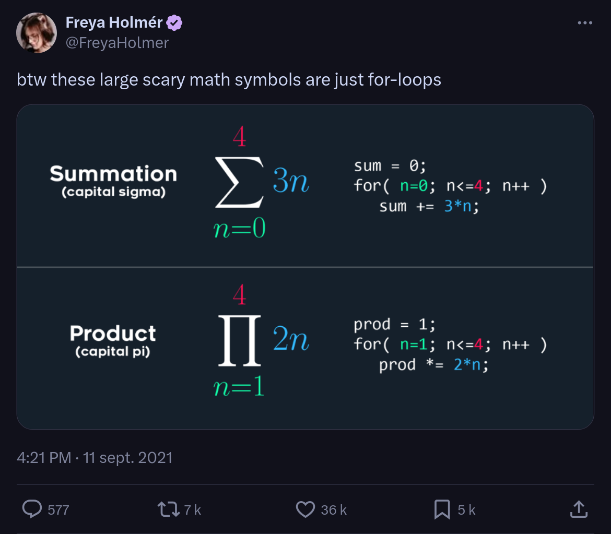


### PeriodicWave
```typescript
// todo code sample
```


### J'ai mis en place deux features, et c'est déjà le bordel
- //TODO illustration spaghetti.
- problèmes : mon composant clé de clavier commande directement l'oscillateur
- n'a pas connaissance de l'échelle ou des boutons de 


### Qui a la source de donnée sur la fréquence / la note ?
- source unique de vérité ?


### Signals et gestion d'état
```typescript
const counter = signal(0);

const oddOrEven = computed(() => counter.value % 2 ? "odd" : "event");

effect(()=>{console.log(oddOrEvent)})
```


### Adapté à mon problème
```typescript
const currentFrequency = signal(440);
const oscillator1Scale = signal<1|2|4|8|16>(2);

const oscillator1Frequency = computed(() => {});
```


## Les potentiomètres
Notes:
- le truc rond, là.
- ou Knob en anglais


###  trigonométrie


###  problématique de rotation, dans quel sens ?

- droite => réduire, gauche => augmenter ?
- ou bien calculer un angle ?


###  ca a l'air simple, mais déjà plein d'events à gérer.


###  machine à états locale au composant


###  comportement-driven-development


###  application sur les filtres


## knob: avancé


###  select vs input/range


###  foutre en l'air sa conception initiale


###  repartir à zéro


###  knob a11y


###  knob select


###  knob range


## Gestion d'état


### découpage statique/dynamique


### différents types d'état 
- statique
- de l'interface
- du modèle de données (ici mon graphe audio)
- du serveur


### signals + computed + effect = win


### architecture en trois couche au final.
- interface
- effects
- audio-graph


###  state machine (pilot, pas allez trop loin là)


###  interface vs state


###  graphe audio = pas mon ui


###  "paramétrage" = ma donnée


###  dériver l'état vers le graphe audio = effect


## Filtres


### Les contrôles

// todo zoom sur la bonne partie

Notes:
- on peut ajuster la fréquence de coupure
- et on peut également ajuster le pic (peak)


### Dans le manuel


Notes:
- si je reviens à mon manuel vous voy


### Passe haut

<div id="high-pass-filter" class="graphics"></div>


### Passe bas

<div id="low-pass-filter" class="graphics"></div>


### Nodes


### peaks


## la ci/cd


###  lint & tests


###  github actions


###  pull-request => deploy sur staging


###  tests reports


###  c'est pas parce que c'est un side projet qu'on va se priver de bonne DX


## Générateurs d'enveloppe


###  revenons au schéma


###  ASDR, attack sustain, release delay.

<div id="envelope-generator-1" class="graphics" />

###  filtres ++

### AudioParam
- setValueAtTime()
- setLinearRampTo()

###  démo 


## Accessibilité


###  comment rendre ce bazar accessible?


###  solution: tout est backup par des composants du dom


###  démo désactivation CSS


###  label, output, tester 


## modulation de fréquences


###  ici des maths lourds


###  fourier


###  section à supprimer si pas le temps


## le boss final : cable graphe


###  connections


###  moteur physique: parce que pourquoi pas ?


###  matter.js 


###  longueur du cable 


###  machine a états


## démo finale


## bonus: 


### Les fonctionnalités pas présentées
- settings et indexedb/pwa
- events claviers
- responsive (lol, faire une blague)


### RAF: le reste à faire
- WebMidi ?
- Micro en entrée.
Notes:
- j'ai fait le coeur de métier, mais je pourrais plug plus de features encore


## Conclusion / Leçons
Notes:
- Comme dans plein de chose, il y a des lecons à tirer de cette avanture


###  L'api webaudio
Notes:
- c'est un gros jouet, peu de cas d'usage en dehors de la synthèse sonore
- Vraiment bizarre, on me force à penser en objets, poser des cables
- est-ce que j'ai besoin de savoir utiliser un synthétiseur modulaire avant d'utiliser cette API
- j'ai l'impression que oui


### Les gens sérieux
- font du C (ou du zig) dans ce domaine
- mais: on est là pour le fun 🤡
Notes: 
- pour des raisons de latence
- javascript est assez versatile pour que ça passe
- anything can be re-written in JS


### Scratch an itch
- Grattez vos démangaisons
- Vous avez envie de faire un truc ?
- Faites-le


### Discipline
- penser MVP
- 2h par jour (30 minutes c'est pas assez)
Notes:
Ça n'empêche pas de 
- faire du code "inutile"
- faites de l'art inutile
- faites de la musique


### Gestion d'état
- que vous le vous le vouliez ou non, vous aurez toujours besoin d'une librairie de..., ou de patterns de.., ou au minimum de penser à la __gestion d'état__.


### Sens de réalisation
- partir de l'interface finale ( ou des maquettes figma ) = 0💩
Notes:
- c'est le meilleur moyen de foirer vos devs front. Orienter sur la donnée.
- conceptualiser, conception avant.


### Ce n'est pas grave
- si vos side-projects prennent du temps
- si ça n'avance pas
Notes:
- Le pire ennemi.
- Ne peignez pas (trop) la girafe. (yack-shaving)
- s'en rendre compte tôt


### Build in public
- postuler à des sujets au conf, ca fout un coup de pression pour finirs ses side-projects.
Notes:
- j'ai aussi fait le truc en stream.


### Les sujets de niche
- L'informatique c'est super-large
- Tous les sujets sont "tech-isables"
- Les portes sont ouvertes, il faut juste foncer dedans.
Notes:


### Échecs
- les knobs
- pas fini dans les temps
Notes:
- C'est la meta-loi


### Succès ?
- ce talk.
- j'ai appris des trucs
Notes:
- peut-être que ca me servira jamais


### Jean-Pierre Legrand (1956-2020)

Notes:
- Pour finir, je voudrais dédicacer ce talk à Jean-Pierre
- Merci de m'avoir légué ce synthé
- Et à vous, merci de m'avoir écouté


### Le bon coin

Notes:
- si jamais ca vous intéresse d'avoir un gros synthé chez vous, je le revends.
- Juste pour vous donner une image de l'argus de ce genre de truc


## Merci
<a href="https://openfeedback.io/0nEhuP6qarjm0R4pbRG1/2025-03-21/rushwpQL24fyn25fNOz2" target="_blank">
  
</a>
